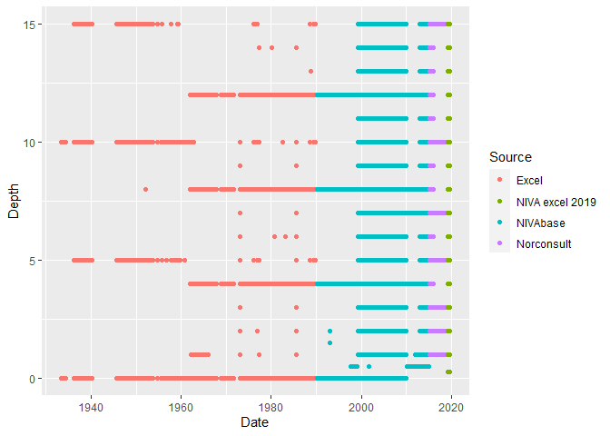
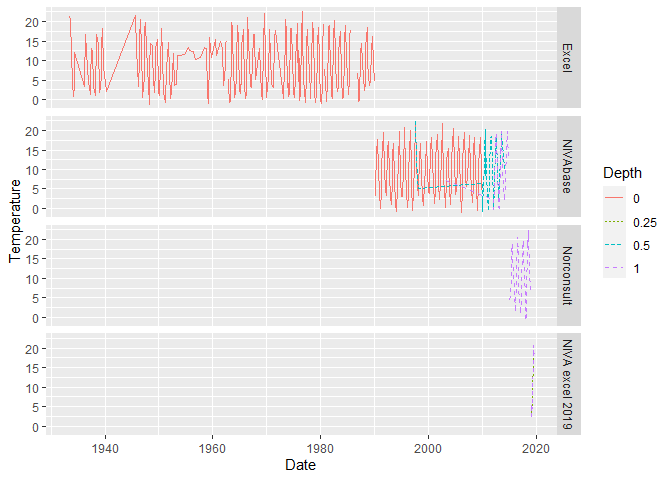
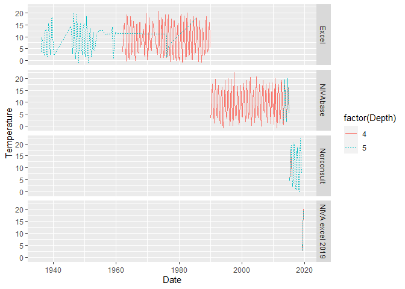
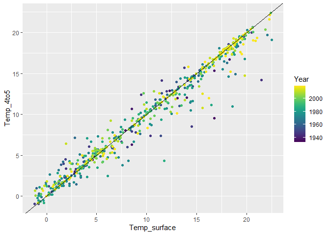
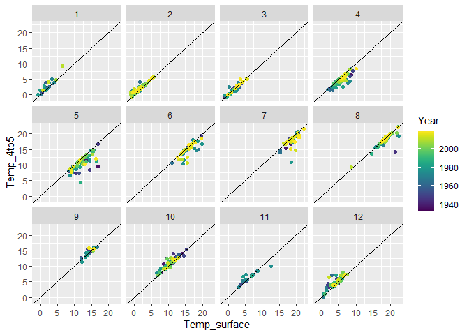
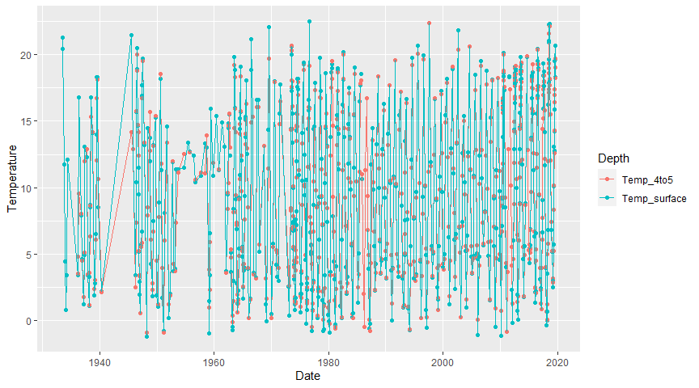
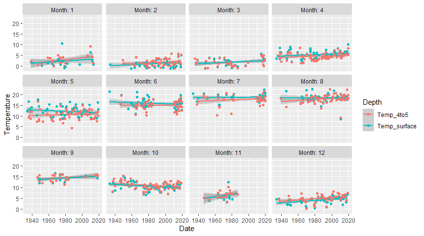

Extract surface and 4-5 temperature for Dk1 (Steilene) in Indre Oslofjord.   
  
Note: this script utilizes data from project "Oslofjord_indre". Both these data and the results form this script have been put here:  
K:/Avdeling/214-Oseanografi/DHJ/Data/Oslofjord_indre  
  


## 1. Libraries  

```r
library(ggplot2)
library(dplyr)
library(readxl)
library(lubridate)
library(purrr)
library(tidyr)
library(viridis)
```

## 2. Read data from project "Oslofjord_indre"  

```r
fn <- "K:/Avdeling/214-Oseanografi/DHJ/Data/Oslofjord_indre/Indre_Oslofjord_temp_salt_1933-2019.rds"
dat <- readRDS(fn)

cat("dat:", nrow(dat), "lines \n")
```

```
## dat: 85089 lines
```
### Check data   
Last date is 2019-08-24  

```r
xtabs(~year(Date), dat)
```

```
## year(Date)
##  1933  1934  1936  1937  1938  1939  1940  1945  1946  1947  1948  1949  1950 
##    52    39    38    37    50    58     8    36   155   126    91   111   145 
##  1951  1952  1953  1954  1955  1956  1957  1958  1959  1960  1961  1962  1963 
##    77    77    62    18    26    26    20    31    62    34    22   225   269 
##  1964  1965  1966  1967  1968  1969  1970  1971  1973  1974  1975  1976  1977 
##   320   293    46    36    18    40    30    44  1077   851   669   466   505 
##  1978  1979  1980  1981  1982  1983  1984  1985  1986  1987  1988  1989  1990 
##   433   375   423   469   720   600   286   261   292   331   526   548   512 
##  1991  1992  1993  1994  1995  1996  1997  1998  1999  2000  2001  2002  2003 
##   498   519   753   584   594   600   703   436   967   817  1025  1055   953 
##  2004  2005  2006  2007  2008  2009  2010  2011  2012  2013  2014  2015  2016 
##  1077  1091  1220  1104  1029  1024  2001   528  2299 12883  7597  9108  2759 
##  2017  2018  2019 
##  2905  3082 13812
```

```r
xtabs(~Date + Station, dat %>% filter(year(Date) == 2019))
```

```
##             Station
## Date         Ap2 Aq2 Aq3 Bl4 Bn1 Br1 Cj1 Cp2 Cq1 Dk1 Dm1 Ej1 Ep1 Fk1 Fl1 Gk1
##   2019-02-07  26  20   7   0  81  14   0   0  70   0   0   0 151   0   0   0
##   2019-02-08   0   0   0   0   0   0  53   0   0 100  82  99   0   0   0   0
##   2019-02-28  25  20   8   0  82  15   0   0  69   0   0   0 151   0   0   0
##   2019-03-01   0   0   0   0   0   0  55  81   0  96   0   0   0   0 167 113
##   2019-03-07   0   0   0   0  77  14  57   0  70  95  84  99 150   0   0   0
##   2019-03-08  25  20   8   0   0   0   0   0   0   0   0   0   0   0   0   0
##   2019-03-14   0   0   0   0   0   0   0   0   0   0   0   0   0 121   0   0
##   2019-03-21   0   0   0   0  80   0  54   0   0 101  82 100 148   0   0   0
##   2019-03-22  25  22   8   0   0  14   0   0  69   0   0   0   0   0   0   0
##   2019-04-15   0  20   8  30  82  14  54   0  68  99  83 100 151   0   0   0
##   2019-04-16  24   0   0   0   0   0   0   0   0   0   0   0   0   0   0   0
##   2019-04-23  25   0   7   0  82   0   0   0  70   0   0   0 150   0   0   0
##   2019-04-24   0   0   0  31   0   0   0  82   0  99  83   0   0   0 165 111
##   2019-05-20  25   0   7   0  82   0   0   0  69   0   0   0 151   0   0   0
##   2019-05-21   0   0   0  29   0   0   0  82   0  99  81   0   0   0 163 113
##   2019-06-03  27  23   7   0  81  15  54   0  70  91  85  94 151   0   0   0
##   2019-06-04   0   0   0  29   0   0   0   0   0   0   0   0   0   0   0   0
##   2019-06-13  24  21   8  30  81  14  51   0  70  94  78 101 152   0   0   0
##   2019-06-24  25  21   9  32  81  15  55   0  68 100  85 100 148   0   0   0
##   2019-07-04  26  19   7  29  78  14  54   0  67  95  80  96 147   0   0   0
##   2019-07-15   0  19   0  28  70  14  53   0  67  95  81  90 152   0   0   0
##   2019-07-16  26   0   9   0   0   0   0   0   0   0   0   0   0   0   0   0
##   2019-07-25   0   0   0  31   0  15  55   0  68 101  82 100 149   0   0   0
##   2019-08-06   0   0   0  29  80   0  53   0   0 101  84 100 149   0   0   0
##   2019-08-07  25  21   8   0   0  14   0   0  69   0   0   0   0   0   0   0
##   2019-08-23  25   0   7   0  80   0   0  82  69   0   0   0 150   0 158 112
##   2019-08-24   0   0   0  30   0   0   0   0   0  98  82  98   0   0   0   0
##             Station
## Date         Gl2 Gp1 Gp2 Hm4 Hm6 Im2
##   2019-02-07   0   0   0   0   0   0
##   2019-02-08   0   0   0   0   0   0
##   2019-02-28   0   0   0   0   0   0
##   2019-03-01 140  16  16 101  20 200
##   2019-03-07   0  14  14   0   0   0
##   2019-03-08   0   0   0   0   0   0
##   2019-03-14   0   0   0   0   0   0
##   2019-03-21   0  14  14   0   0   0
##   2019-03-22   0   0   0   0   0   0
##   2019-04-15   0  14  14   0   0   0
##   2019-04-16   0   0   0   0   0   0
##   2019-04-23   0   0   0   0   0   0
##   2019-04-24 137  15  15  99  21 201
##   2019-05-20   0  13  13   0   0   0
##   2019-05-21 137   0   0  97  20 202
##   2019-06-03   0  14  14   0   0   0
##   2019-06-04   0   0   0   0   0   0
##   2019-06-13   0  14  14   0   0   0
##   2019-06-24   0  15  15   0   0   0
##   2019-07-04   0  14  14   0   0   0
##   2019-07-15   0  14  14   0   0   0
##   2019-07-16   0   0   0   0   0   0
##   2019-07-25   0  15  15   0   0   0
##   2019-08-06   0  14  14   0   0   0
##   2019-08-07   0   0   0   0   0   0
##   2019-08-23 139  15  15 100  19 199
##   2019-08-24   0   0   0   0   0   0
```


## 3. Check whether there are newer data    
CDT files prepared by André   
Turns out this has no newer data    

```r
#
# Code from script 34 in project "Oslofjord_indre"   (section 4 data 'd')
#

folder <- "K:/Avdeling/214-Oseanografi/DATABASER/OKOKYST_2017/IO_2019_2023/xlsbase_IO"
files <- dir(folder)
files <- files[!substr(files,1,1) == "~"]
files <- files[!files %in% c("IO2019_CTD_uferdig.xlsm", "notes.txt", "Thumbs.db", "Til_Aquamonitor")]
files
```

```
##  [1] "Ap2_CTD_2019.xlsx" "Aq2_CTD_2019.xlsx" "Aq3_CTD_2019.xlsx"
##  [4] "Bl4_CTD_2019.xlsx" "Bn1_CTD_2019.xlsx" "Br1_CTD_2019.xlsx"
##  [7] "Cj1_CTD_2019.xlsx" "Cp2_CTD_2019.xlsx" "Cq1_CTD_2019.xlsx"
## [10] "Dk1_CTD_2019.xlsx" "Dm1_CTD_2019.xlsx" "Ej1_CTD_2019.xlsx"
## [13] "Ep1_CTD_2019.xlsx" "Fk1_CTD_2019.xlsx" "Fl1_CTD_2019.xlsx"
## [16] "Gk1_CTD_2019.xlsx" "Gl2_CTD_2019.xlsx" "Gp1_CTD_2019.xlsx"
## [19] "Gp2_CTD_2019.xlsx" "Hm4_CTD_2019.xlsx" "Hm6_CTD_2019.xlsx"
## [22] "Im2_CTD_2019.xlsx"
```

```r
names(files) <- files

# Read all files, saved as list (ca 10 seconds)
dat_xl_list <- files %>% purrr::map(~readxl::read_excel(paste0(folder, "/", .), sheet = "nc"))

# Check column names
# dat_xl_list %>% map(names)

# Check StationId
# dat_xl_list %>% map(~xtabs(~StationId, .))

# In file Gp2_CTD_2019.xlsx, StationId = Gp1
# We correct this:
dat_xl_list[["Gp2_CTD_2019.xlsx"]]$StationId <- "Gp2"

# Column names ok - we combine to a single data frame
dat_xl <- bind_rows(dat_xl_list)

# str(dat_xl)

df_d <- dat_xl %>%
  mutate(Time = as.POSIXct((Date - 25569)*24*3600, origin = "1970-01-01", tz = "GMT"),
         Date = round_date(Time, "day") %>% as.Date(),
         Depth = (Depth1 + Depth2)/2
         ) %>%
  rename(Station = StationId,
         Temperature = Temperatur,
         Salinity = Saltholdighet) %>%
  select(Station, Date, Depth, Temperature, Salinity) %>%
  mutate(Source = "NIVA excel 2019")
  
xtabs(~Date + Station, df_d)
```

```
##             Station
## Date         Ap2 Aq2 Aq3 Bl4 Bn1 Br1 Cj1 Cp2 Cq1 Dk1 Dm1 Ej1 Ep1 Fk1 Fl1 Gk1
##   2019-02-07  26  20   7   0  81  14   0   0  70   0   0   0 151   0   0   0
##   2019-02-08   0   0   0   0   0   0  53   0   0 100  82  99   0   0   0   0
##   2019-02-28  25  20   8   0  82  15   0   0  69   0   0   0 151   0   0   0
##   2019-03-01   0   0   0   0   0   0  55  81   0  96   0   0   0   0 167 113
##   2019-03-07   0   0   0   0  77  14  57   0  70  95  84  99 150   0   0   0
##   2019-03-08  25  20   8   0   0   0   0   0   0   0   0   0   0   0   0   0
##   2019-03-14   0   0   0   0   0   0   0   0   0   0   0   0   0 121   0   0
##   2019-03-21   0   0   0   0  80   0  54   0   0 101  82 100 148   0   0   0
##   2019-03-22  25  22   8   0   0  14   0   0  69   0   0   0   0   0   0   0
##   2019-04-15   0  20   8  30  82  14  54   0  68  99  83 100 151   0   0   0
##   2019-04-16  24   0   0   0   0   0   0   0   0   0   0   0   0   0   0   0
##   2019-04-23  25   0   7   0  82   0   0   0  70   0   0   0 150   0   0   0
##   2019-04-24   0   0   0  31   0   0   0  82   0  99  83   0   0   0 165 111
##   2019-05-20  25   0   7   0  82   0   0   0  69   0   0   0 151   0   0   0
##   2019-05-21   0   0   0  29   0   0   0  82   0  99  81   0   0   0 163 113
##   2019-06-03  27  23   7   0  81  15  54   0  70  91  85  94 151   0   0   0
##   2019-06-04   0   0   0  29   0   0   0   0   0   0   0   0   0   0   0   0
##   2019-06-13  24  21   8  30  81  14  51   0  70  94  78 101 152   0   0   0
##   2019-06-24  25  21   9  32  81  15  55   0  68 100  85 100 148   0   0   0
##   2019-07-04  26  19   7  29  78  14  54   0  67  95  80  96 147   0   0   0
##   2019-07-15   0  19   0  28  70  14  53   0  67  95  81  90 152   0   0   0
##   2019-07-16  26   0   9   0   0   0   0   0   0   0   0   0   0   0   0   0
##   2019-07-25   0   0   0  31   0  15  55   0  68 101  82 100 149   0   0   0
##   2019-08-06   0   0   0  29  80   0  53   0   0 101  84 100 149   0   0   0
##   2019-08-07  25  21   8   0   0  14   0   0  69   0   0   0   0   0   0   0
##   2019-08-23  25   0   7   0  80   0   0  82  69   0   0   0 150   0 158 112
##   2019-08-24   0   0   0  30   0   0   0   0   0  98  82  98   0   0   0   0
##             Station
## Date         Gl2 Gp1 Gp2 Hm4 Hm6 Im2
##   2019-02-07   0   0   0   0   0   0
##   2019-02-08   0   0   0   0   0   0
##   2019-02-28   0   0   0   0   0   0
##   2019-03-01 140  16  16 101  20 200
##   2019-03-07   0  14  14   0   0   0
##   2019-03-08   0   0   0   0   0   0
##   2019-03-14   0   0   0   0   0   0
##   2019-03-21   0  14  14   0   0   0
##   2019-03-22   0   0   0   0   0   0
##   2019-04-15   0  14  14   0   0   0
##   2019-04-16   0   0   0   0   0   0
##   2019-04-23   0   0   0   0   0   0
##   2019-04-24 137  15  15  99  21 201
##   2019-05-20   0  13  13   0   0   0
##   2019-05-21 137   0   0  97  20 202
##   2019-06-03   0  14  14   0   0   0
##   2019-06-04   0   0   0   0   0   0
##   2019-06-13   0  14  14   0   0   0
##   2019-06-24   0  15  15   0   0   0
##   2019-07-04   0  14  14   0   0   0
##   2019-07-15   0  14  14   0   0   0
##   2019-07-16   0   0   0   0   0   0
##   2019-07-25   0  15  15   0   0   0
##   2019-08-06   0  14  14   0   0   0
##   2019-08-07   0   0   0   0   0   0
##   2019-08-23 139  15  15 100  19 199
##   2019-08-24   0   0   0   0   0   0
```
## 4. Dk1 temperature {.tabset} 

### Depths  

```r
dat %>%
  filter(Depth <= 15) %>%
  ggplot(aes(Date, Depth, color = Source)) +
  geom_point()
```

<!-- -->


### Surface (0-1 m)  

```r
gg <- dat %>%
  filter(Depth <= 1 & Station == "Dk1") %>%
  arrange(Date) %>%
  mutate(Source = forcats::fct_inorder(Source),
         Depth = factor(Depth)) %>%
  ggplot(aes(Date, Temperature, color = Depth, linetype = Depth)) +
  geom_line()
gg + 
  facet_grid(rows = vars(Source))
```

<!-- -->
### 4-5 m    

```r
gg <- dat %>%
  filter(Depth >= 4 & Depth <= 5.5 & Station == "Dk1") %>%
  arrange(Date) %>%
  mutate(Source = forcats::fct_inorder(Source),
         Depth = factor(Depth)) %>%
  ggplot(aes(Date, Temperature, color = factor(Depth), linetype = factor(Depth))) +
  geom_line()
gg + 
  facet_grid(rows = vars(Source))
```

<!-- -->
  
## 5. Pick Dk1 surface + 5 m data   
  
### Surface  
* Through 2009: 0 m only   
* 2010-2012: 0.5 m, plus sometimes 1 m. Pick 0.5 m  
* 2013-2018: 1.0 m, plus sometimes 0.5 m. Pick 1 m  
* 2019: 0.25 m + 1 m. Pick 0.25 m      

```r
dk1_surface <- dat %>%
  filter(Depth <= 1 & Station == "Dk1") %>%
  select(Date, Depth, Temperature) %>%
  tidyr::pivot_wider(names_from = "Depth", values_from = "Temperature")

if (FALSE){
  View(dk1_surface %>% filter(year(Date) >= 2008))
}

dk1_surface <- dk1_surface %>%
  mutate(
    Temp_surface = case_when(
      year(Date) <= 2009 ~ `0`,
      year(Date) <= 2012 ~ `0.5`,
      year(Date) <= 2018 ~ `1`,
      year(Date) <= 2019 ~ `0.25`),
    Depth_surface = case_when(
      year(Date) <= 2009 ~ 0,
      year(Date) <= 2012 ~ 0.5,
      year(Date) <= 2018 ~ 1,
      year(Date) <= 2019 ~ 0.25)
    )

cat("dk1_surface:", nrow(dk1_surface), "lines \n")
```

```
## dk1_surface: 626 lines
```
### 4-5 m    
* Through 1960: 5 m only   
* 1962-2012: 4 m, plus sometimes 5 m. Pick 4 m   
* 2013-2014: Both 4 and 5 m. Pick 5 m   
* 2015-2019: 5 m, plus sometimes 4 m. Pick 5 m   

```r
dk1_4to5m <- dat %>%
  filter(Depth >= 4 & Depth <= 5.5 & Station == "Dk1") %>%
  select(Date, Depth, Temperature) %>%
  tidyr::pivot_wider(names_from = "Depth", values_from = "Temperature")

if (FALSE){
  View(dk1_4to5m %>% filter(year(Date) %in% 1960:1965))
  View(dk1_4to5m %>% filter(year(Date) %in% 2010:2020))
}

dk1_4to5m <- dk1_4to5m %>%
  mutate(
    Temp_4to5 = case_when(
      year(Date) <= 1961 ~ `5`,
      year(Date) <= 2012 ~ `4`,
      year(Date) <= 2019 ~ `5`),
    Depth_4to5 = case_when(
      year(Date) <= 1961 ~ 5,
      year(Date) <= 2012 ~ 4,
      year(Date) <= 2019 ~ 5)
    )

cat("dk1_4to5m:", nrow(dk1_4to5m), "lines \n")
```

```
## dk1_4to5m: 612 lines
```


### Combine  


```r
dk1_temp_0to5meter <- full_join(dk1_surface, dk1_4to5m, by = "Date") %>%
  mutate(Year = year(Date),
         Month = month(Date))

cat("dk1_temp_0to5meter:", nrow(dk1_temp_0to5meter), "lines \n")
```

```
## dk1_temp_0to5meter: 634 lines
```


## 6. Plot {.tabset}  

### 5 m vs surface  

```r
ggplot(dk1_temp_0to5meter, aes(Temp_surface, Temp_4to5, color = Year)) +
  geom_point() +
  scale_color_viridis() +
  geom_abline(intercept = 0, slope = 1)
```

```
## Warning: Removed 44 rows containing missing values (geom_point).
```

<!-- -->

### 5 m vs surface by month  

```r
ggplot(dk1_temp_0to5meter, aes(Temp_surface, Temp_4to5, color = Year)) +
  geom_point() +
  scale_color_viridis() +
  geom_abline(intercept = 0, slope = 1) +
  facet_wrap(vars(Month))
```

```
## Warning: Removed 44 rows containing missing values (geom_point).
```

<!-- -->

### Time series

```r
dk1_temp_0to5meter_long <- dk1_temp_0to5meter %>%
  select(Date, Year, Month, Temp_surface, Temp_4to5) %>%
  tidyr::pivot_longer(c(Temp_surface, Temp_4to5), names_to = "Depth", values_to = "Temperature")
  
ggplot(dk1_temp_0to5meter_long, aes(Date, Temperature, color = Depth)) +
  geom_point() +
  geom_line()
```

```
## Warning: Removed 47 rows containing missing values (geom_point).
```

```
## Warning: Removed 7 row(s) containing missing values (geom_path).
```

<!-- -->

### Time series by month  

```r
ggplot(dk1_temp_0to5meter_long, aes(Date, Temperature, color = Depth)) +
  geom_smooth(method = "lm", formula = 'y ~ x') +
  geom_point() +
  facet_wrap(vars(Month), labeller = "label_both")
```

```
## Warning: Removed 47 rows containing non-finite values (stat_smooth).
```

```
## Warning: Removed 47 rows containing missing values (geom_point).
```

<!-- -->
## 7. Save  

```r
saveRDS(dk1_temp_0to5meter, "Data/dk1_temp_0to5meter.rds")
saveRDS(dk1_temp_0to5meter_long, "Data/dk1_temp_0to5meter_long.rds")


notes_for_excel <- tribble(
  ~ Notes,
  "Surface data are frpom depth 0, 0.25, 0.5 and/or 1 m",
  "Temp_surface gives temperature at one of these depths (Depth_surface gives the depth used for each line)",
  "Same for Temp_4to5 (depth at 4 or 5 m depth)",
  NA,
  "Rules used for surface:",
  "* Through 2009: 0 m only",   
  "* 2010-2012: 0.5 m, plus sometimes 1 m. Pick 0.5 m",  
  "* 2013-2018: 1.0 m, plus sometimes 0.5 m. Pick 1 m",  
  "* 2019: 0.25 m + 1 m. Pick 0.25 m", 
  NA,
  "Rules used for 4-5 m:",
  "* Through 1960: 5 m only",   
  "* 1962-2012: 4 m, plus sometimes 5 m. Pick 4 m",   
  "* 2013-2014: Both 4 and 5 m. Pick 5 m",   
  "* 2015-2019: 5 m, plus sometimes 4 m. Pick 5 m",
  NA,
  "These data are based on",
  "K:/Avdeling/214-Oseanografi/DHJ/Data/Oslofjord_indre/Indre_Oslofjord_temp_salt_1933-2019.rds",
  "and were produced by DHJ using",
  "C:/Data/Various-R/Annette_temp_DK1/02_Collect_data.Rmd"
)

list(
  data = dk1_temp_0to5meter,
  notes = notes_for_excel
  ) %>%
  writexl::write_xlsx("Data/dk1_temp_0to5meter.xlsx")

list(
  data = dk1_temp_0to5meter_long,
  notes = notes_for_excel
  ) %>%
  writexl::write_xlsx("Data/dk1_temp_0to5meter_long.xlsx")
```

