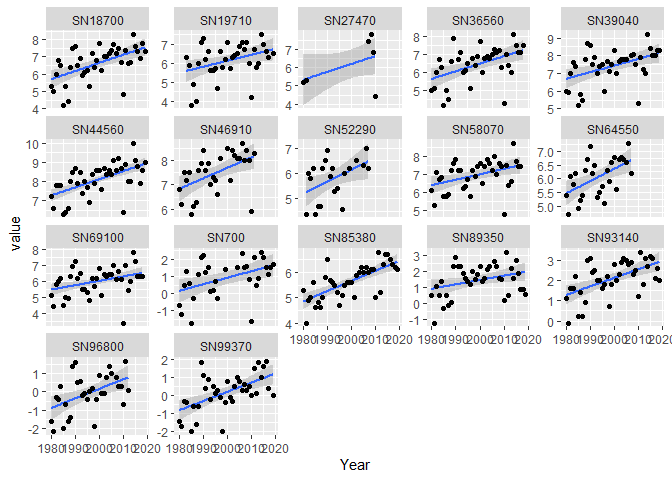
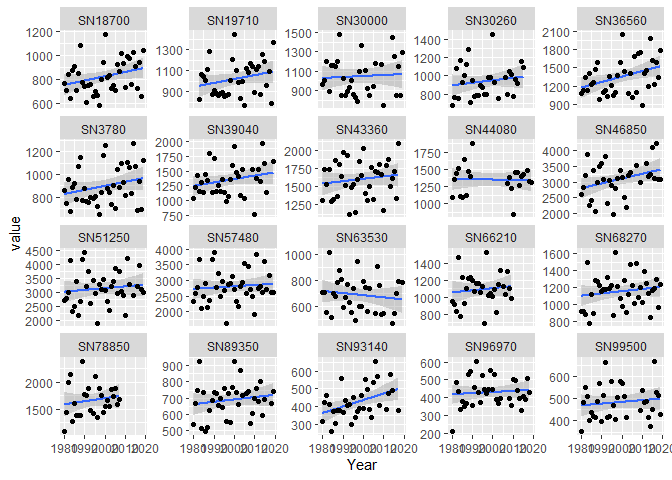
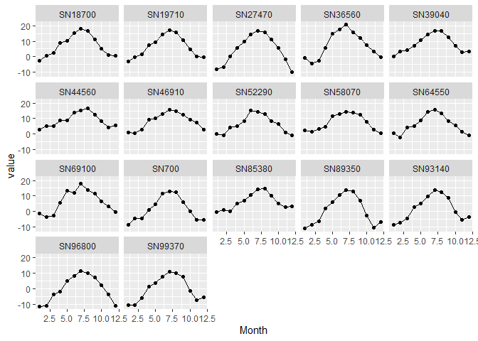
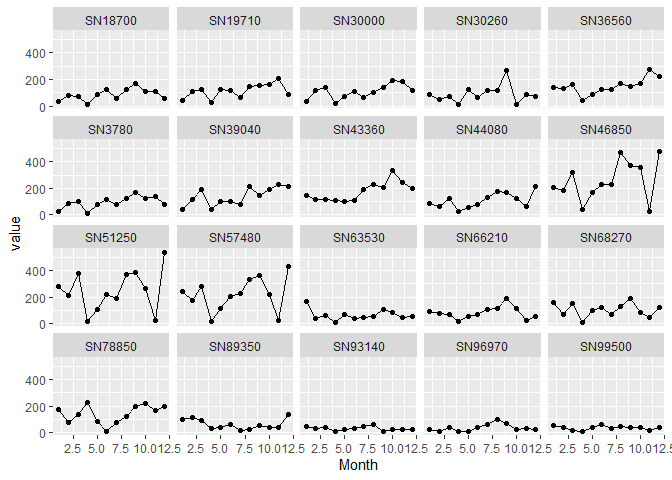

    
*Air temperature and precipitation for a bunch of stations*    
* Part 1- Username  
* Parts 2-3 - Get annual mean air temperature and precipitation for a bunch of stations and perform Theil-Sen regression
* Part 4 - Find stations on interactive map  
* Part 5 - Get monthly data
    
Technically:  
* Based on examples from https://frost.met.no/ex_userquest  
* NOTE: Some nice function for finding stations in part 4  
* Also see https://github.com/metno/gibson and https://github.com/metno/esd 
(not used here, tested elsewhere)
   
Also see station map here: http://eklima.met.no/Help/Stations/toDay/all/no_Stations.html  
   
**Important note:** for monthly data (part 5), there are two offsets for each series: PT0H and PT6H. Which to use?  
- For precipitation "sum(precipitation_amount P1M)", we use PT6H	(standard sampling period for precipitation is 07-06 UTC)  
- For temperature "mean(air_temperature P1M)", we use PT0H	 
Source: https://frost.met.no/dataclarifications.html 


## Years  

```r
year1 <- 1980
year2 <- 2019
```


## 0. Libraries  


## 1. Username
Stores your username in an object we call 'opts' (is used later)
* How to get username - see   
   https://frost.met.no/concepts#getting_started


```r
opts <- curlOptions(
  userpwd = txt_pwd, 
  ftp.filemethod = "singlecwd")
```


## 2. Example station: Melsom   

### a. Station identifier

```r
stid <- "SN18700"
```


### b. Avaliable series


```r
df_info <- get_series_from_station(stid)
# View(df_info)
head(df_info)
```

```
##             validFrom    validTo timeResolution
## 1 1931-01-01 06:00:00       <NA>            P1M
## 2 1937-11-01 00:00:00       <NA>            P1M
## 3 1937-03-01 00:00:00 2020-06-30            P3M
## 4 1937-02-01 00:00:00       <NA>            P1M
## 5 1837-04-01 00:00:00       <NA>            P3M
## 6 2006-04-03 00:00:00       <NA>            P1M
##                                                   elementId       unit
## 1                   best_estimate_mean(air_temperature P1M)       degC
## 2                               min(snow_coverage_type P1M)       code
## 3               mean(air_temperature_anomaly P3M 1961_1990)       degC
## 4     integral_of_excess(mean(air_temperature P1D) P1M 5.0) degree-day
## 5 best_estimate_mean(air_temperature_anomaly P3M 1961_1990)       degC
## 6                            mean(surface_air_pressure P1M)        hPa
```

#### b1. Available time resolutions - from 1 hour (PT1H) to 1 year (P1Y)

```r
table(df_info$timeResolution)
```

```
## 
##   P1D   P1M   P1Y   P3M   P6M PT10M PT12H  PT1H  PT1M  PT6H 
##    50    61    11    10     8     1     3    26     2    16
```

#### b2. Available year-level series  

```r
subset(df_info, timeResolution == "P1Y")$elementId
```

```
##  [1] "mean(air_temperature P1Y)"                                
##  [2] "best_estimate_mean(air_temperature_anomaly P1Y 1961_1990)"
##  [3] "min(air_temperature P1Y)"                                 
##  [4] "max(air_temperature P1Y)"                                 
##  [5] "sum(precipitation_amount_anomaly P1Y 1961_1990)"          
##  [6] "mean(air_temperature_anomaly P1Y 1961_1990)"              
##  [7] "sum(precipitation_amount P1Y)"                            
##  [8] "best_estimate_mean(air_temperature P1Y)"                  
##  [9] "day_of_year_for_birch_leafing"                            
## [10] "integral_of_deficit(mean(air_temperature P1D) P1Y 17.0)"  
## [11] "mean(cloud_area_fraction P1Y)"
```

### c. Get temperature data from Oslo Blindern

```r
# year1, year2, parameter, station
# debugonce(get_data)
# debugonce(get_data_i)
df <- get_data(year1, year2, "mean(air_temperature P1Y)", "SN18700")
head(df)
```

```
##                   Parameter  sourceId referenceTime                 elementId
## 1 mean(air_temperature P1Y) SN18700:0    1980-01-01 mean(air_temperature P1Y)
## 2 mean(air_temperature P1Y) SN18700:0    1981-01-01 mean(air_temperature P1Y)
## 3 mean(air_temperature P1Y) SN18700:0    1982-01-01 mean(air_temperature P1Y)
## 4 mean(air_temperature P1Y) SN18700:0    1983-01-01 mean(air_temperature P1Y)
## 5 mean(air_temperature P1Y) SN18700:0    1984-01-01 mean(air_temperature P1Y)
## 6 mean(air_temperature P1Y) SN18700:0    1985-01-01 mean(air_temperature P1Y)
##   value unit timeOffset timeResolution timeSeriesId performanceCategory
## 1   5.3 degC       PT0H            P1Y            0                   C
## 2   5.0 degC       PT0H            P1Y            0                   C
## 3   6.0 degC       PT0H            P1Y            0                   C
## 4   6.8 degC       PT0H            P1Y            0                   C
## 5   6.5 degC       PT0H            P1Y            0                   C
## 6   4.2 degC       PT0H            P1Y            0                   C
##   exposureCategory qualityCode
## 1                2           2
## 2                2           2
## 3                2           2
## 4                2           2
## 5                2           2
## 6                2           2
```

### d. Note: One can also get data for several stations at once!  
This could be utilized in part 2 (but it is not)

```r
df <- get_data(year1, year2, "mean(air_temperature P1Y)", "SN18700,SN50540")
head(df)
```

```
##                   Parameter  sourceId referenceTime                 elementId
## 1 mean(air_temperature P1Y) SN18700:0    1980-01-01 mean(air_temperature P1Y)
## 2 mean(air_temperature P1Y) SN18700:0    1981-01-01 mean(air_temperature P1Y)
## 3 mean(air_temperature P1Y) SN18700:0    1982-01-01 mean(air_temperature P1Y)
## 4 mean(air_temperature P1Y) SN18700:0    1983-01-01 mean(air_temperature P1Y)
## 5 mean(air_temperature P1Y) SN18700:0    1984-01-01 mean(air_temperature P1Y)
## 6 mean(air_temperature P1Y) SN18700:0    1985-01-01 mean(air_temperature P1Y)
##   value unit timeOffset timeResolution timeSeriesId performanceCategory
## 1   5.3 degC       PT0H            P1Y            0                   C
## 2   5.0 degC       PT0H            P1Y            0                   C
## 3   6.0 degC       PT0H            P1Y            0                   C
## 4   6.8 degC       PT0H            P1Y            0                   C
## 5   6.5 degC       PT0H            P1Y            0                   C
## 6   4.2 degC       PT0H            P1Y            0                   C
##   exposureCategory qualityCode
## 1                2           2
## 2                2           2
## 3                2           2
## 4                2           2
## 5                2           2
## 6                2           2
```

### e. Theil-Sen regression using function  

```r
a <- get_theil_sen(year1, year2, "mean(air_temperature P1Y)", "SN27450")
b <- get_theil_sen(year1, year2, "sum(precipitation_amount P1Y)", "SN18700")

bind_rows(a$statistics, b$statistics)
```

```
##                       Parameter Station Year1 Year2          P   Estimate
## 1     mean(air_temperature P1Y) SN27450  1980  2019 0.01167291 0.03333333
## 2 sum(precipitation_amount P1Y) SN18700  1980  2019 0.06736779 4.02008621
##       Change
## 1   1.166667
## 2 140.703017
```


## 3. Get trends    
See part 4 for how to find stations

### a. Temperature

```r
x <- c(700,18700,19710,27470,27470,36560,39040,44560,44560,46910,52290,
       58070,64550,69100,69100,85380,89350,93140,96800,99370)
stations_temp <- paste0("SN", x)

get_theil_sen_safe <- safely(get_theil_sen)  # generates a list with $result and $error

result_list1 <- stations_temp %>% map(~get_theil_sen_safe(year1, year2, "mean(air_temperature P1Y)", .))
not_ok <- result_list1 %>% map_lgl(is.null)
mean(not_ok)   # Should be zero!
```

```
## [1] 0
```

```r
result_list2 <- transpose(result_list1)$result  # Go down to 1st level of list
result_temp <- transpose(result_list2)$statistics %>% bind_rows()  # Go down to 1st level of list

# df_temp <- stations_temp[1:2] %>% map_df(~get_theil_sen(year1, year2, "mean(air_temperature P1Y)", .))
result_temp
```

```
##                    Parameter Station Year1 Year2            P   Estimate
## 1  mean(air_temperature P1Y)   SN700  1980  2019 8.015196e-03 0.03779762
## 2  mean(air_temperature P1Y) SN18700  1980  2019 1.644078e-04 0.04807407
## 3  mean(air_temperature P1Y) SN19710  1983  2019 2.697652e-02 0.02939815
## 4  mean(air_temperature P1Y) SN27470  1980  2010 1.000000e+00 0.05357143
## 5  mean(air_temperature P1Y) SN27470  1980  2010 1.000000e+00 0.05357143
## 6  mean(air_temperature P1Y) SN36560  1980  2018 4.822511e-04 0.04000000
## 7  mean(air_temperature P1Y) SN39040  1980  2019 1.252731e-03 0.03333333
## 8  mean(air_temperature P1Y) SN44560  1980  2019 4.099820e-05 0.04031250
## 9  mean(air_temperature P1Y) SN44560  1980  2019 4.099820e-05 0.04031250
## 10 mean(air_temperature P1Y) SN46910  1980  2011 3.169285e-03 0.04500000
## 11 mean(air_temperature P1Y) SN52290  1981  2007 2.605143e-02 0.03958333
## 12 mean(air_temperature P1Y) SN58070  1980  2017 4.174919e-03 0.03181818
## 13 mean(air_temperature P1Y) SN64550  1980  2007 3.175127e-03 0.04749373
## 14 mean(air_temperature P1Y) SN69100  1980  2018 1.125290e-02 0.03076923
## 15 mean(air_temperature P1Y) SN69100  1980  2018 1.125290e-02 0.03076923
## 16 mean(air_temperature P1Y) SN85380  1980  2019 1.315169e-06 0.04285714
## 17 mean(air_temperature P1Y) SN89350  1980  2019 9.142256e-02 0.02222222
## 18 mean(air_temperature P1Y) SN93140  1980  2019 5.974040e-04 0.04000000
## 19 mean(air_temperature P1Y) SN96800  1980  2012 7.704347e-03 0.05192593
## 20 mean(air_temperature P1Y) SN99370  1980  2019 6.450395e-04 0.05000000
##       Change
## 1  1.3229167
## 2  1.6825926
## 3  1.0289352
## 4  1.8750000
## 5  1.8750000
## 6  1.4000000
## 7  1.1666667
## 8  1.4109375
## 9  1.4109375
## 10 1.5750000
## 11 1.3854167
## 12 1.1136364
## 13 1.6622807
## 14 1.0769231
## 15 1.0769231
## 16 1.5000000
## 17 0.7777778
## 18 1.4000000
## 19 1.8174074
## 20 1.7500000
```

#### Plot  

```r
data_plot <- transpose(result_list2)$data %>% bind_rows()

# data_plot

ggplot(data_plot, aes(Year, value)) +
  geom_smooth(method = "lm") +
  geom_point() +
  facet_wrap(vars(Station), scales = "free_y")
```

```
## `geom_smooth()` using formula 'y ~ x'
```

<!-- -->

### b. Precipitation

```r
x <- c(3780,18700,19710,30000,30260,36560,39040,43360,44080,
       46850,51250,57480,63530,66210,68270,78850,89350,93140,96970,99500)

stations_prec <- paste0("SN", x)

result_list1 <- stations_prec %>% map(~get_theil_sen_safe(year1, year2, "sum(precipitation_amount P1Y)", .))
not_ok <- result_list1 %>% map_lgl(is.null)
mean(not_ok)   # Should be zero!
```

```
## [1] 0
```

```r
result_list2 <- transpose(result_list1)$result  # Go down to 1st level of list
result_prec <- transpose(result_list2)$result %>% bind_rows()

result_prec
```

```
## data frame with 0 columns and 0 rows
```

#### Plot  

```r
data_plot <- transpose(result_list2)$data %>% bind_rows()

# data_plot

ggplot(data_plot, aes(Year, value)) +
  geom_smooth(method = "lm") +
  geom_point() +
  facet_wrap(vars(Station), scales = "free_y")
```

```
## `geom_smooth()` using formula 'y ~ x'
```

<!-- -->

### c. Save  

```r
res <- list(Temperature = result_temp, Precipitation = result_prec)

openxlsx::write.xlsx(
  res, 
  paste0(
    "Data/Elevoverv_trends_climate_", year1, "-", year2, ".xlsx (script 01).xlsx"
    )
)
```


## 4. Check available stations  

### a. Check available temperature series  
Overlapping wholly or partly with this period

```r
df <- get_station_from_parameter("mean(air_temperature P1Y)", 2016, 2017)
head(df)
```

```
##    sourceId  validFrom performanceCategory
## 1 SN27450:0 2011-08-12                   C
## 2 SN99910:0 2007-09-24                   C
## 3 SN28380:0 2003-03-01                   C
## 4 SN43010:0 2006-05-25                   C
## 5 SN99950:0 2008-07-28                   C
## 6  SN3290:0 2014-12-08                   E
```

### b. Get information on station, incl. coordinates  

```r
# A single string
df_station <- get_station_meta("SN44190,SN27450")
df_station
```

```
##        id shortName               county masl  validFrom    Long     Lat
## 1 SN27450    Melsom VESTFOLD OG TELEMARK   26 1959-04-01 10.3483 59.2300
## 2 SN44190      Time             ROGALAND   92 1981-08-13  5.7262 58.7345
```

```r
# A vector of strings
df_station <- get_station_meta(c("SN44190","SN27450"))
df_station
```

```
##        id shortName               county masl  validFrom    Long     Lat
## 1 SN27450    Melsom VESTFOLD OG TELEMARK   26 1959-04-01 10.3483 59.2300
## 2 SN44190      Time             ROGALAND   92 1981-08-13  5.7262 58.7345
```

```r
# A vector of strings, including ":0"
df_station <- get_station_meta(c("SN31660:0", "SN40250:0"))
df_station
```

```
##        id shortName               county masl  validFrom   Long     Lat
## 1 SN40250     Valle                AGDER  308 1872-01-01 7.5273 59.1972
## 2 SN31660     Mogen VESTFOLD OG TELEMARK  954 1930-09-01 7.9130 60.0180
```

```r
# Feed it with the output of previous chunk. Note that only "SN" stations are used
df_station <- get_station_meta(df$sourceId)
nrow(df_station)
```

```
## [1] 230
```


### c. Show one station on Norgeskart


```r
if (interactive()){
  show_norgeskart(df_station, 1)   # station number one in file
  # OR vector
  show_norgeskart(c(60, 11))
  # OR two values
  show_norgeskart(60, 11)
}
```

### d. Show stations on leaflet map


```r
library(leaflet)

df_station <- df_station %>%
  mutate(Popuptext = 
           paste0(id, "<BR>",
                  "<B>", shortName, "</B><BR>",
                  "M.a.s.l. = ", masl, "<BR>",
                  "valid from = ", validFrom, "<BR>",
                  "Coor.: ", round(Long, 4), ", ", round(Lat, 4))
         )

leaflet() %>%
  addTiles() %>%
  addMarkers(lng = df_station$Long, lat = df_station$Lat,
             popup = df_station$Popuptext)
```

<!--html_preserve--><div id="htmlwidget-2b0a3b212772bebe26c0" style="width:672px;height:480px;" class="leaflet html-widget"></div>
<script type="application/json" data-for="htmlwidget-2b0a3b212772bebe26c0">{"x":{"options":{"crs":{"crsClass":"L.CRS.EPSG3857","code":null,"proj4def":null,"projectedBounds":null,"options":{}}},"calls":[{"method":"addTiles","args":["//{s}.tile.openstreetmap.org/{z}/{x}/{y}.png",null,null,{"minZoom":0,"maxZoom":18,"tileSize":256,"subdomains":"abc","errorTileUrl":"","tms":false,"noWrap":false,"zoomOffset":0,"zoomReverse":false,"opacity":1,"zIndex":1,"detectRetina":false,"attribution":"&copy; <a href=\"http://openstreetmap.org\">OpenStreetMap<\/a> contributors, <a href=\"http://creativecommons.org/licenses/by-sa/2.0/\">CC-BY-SA<\/a>"}]},{"method":"addMarkers","args":[[69.3073,59.23,58.507,59.6247,63.4107,63.4115,70.9394,59.3882,70.06,78.9243,59.9423,58.9563,62.7443,60.567,60.6252,70.0653,60.383,60.53,62.9535,61.2247,59.497,58.9688,56.5434,59.1845,61.2943,61.1033,65.32285,59.4352,60.5938,58.2772,59.7537,63.1093,62.9853,66.3705,70.6807,68.58,64.352,71.0105,59.9119,62.9763,59.1208,59.6027,63.4882,62.2695,65.7017,62.034,69.6767,59.16,71.0937,69.4635,62.4703,77.8953,59.7908,68.155,58.6592,58.8565,66.9368,61.4582,70.4865,60.3887,58.3988,62.6785,69.6005,59.7662,59.8397,68.8029,60.0435,60.5637,59.3445,65.2023,60.7002,58.34,60.1665,65.8295,59.3065,67.2763,62.5617,61.122,61.5648,63.4597,69.3875,59.0705,59.4927,61.6513,65.8255,62.5773,69.0577,59.2852,59.6479,59.9708,59.7933,60.2065,69.9775,64.835,62.1133,61.5832,61.4255,61.8957,68.2453,62.9133,58.0247,59.5667,59.6605,61.5717,63.8467,58.6582,59.4198,67.5267,60.8028,66.3643,61.391,66.8102,58.134,57.9815,61.1724,69.6538,64.5103,68.9968,60.1173,59.3188,63.5652,68.7817,64.0217,62.1282,58.6361,64.7977,60.383,58.4353,63.3153,58.2,61.4233,59.8497,61.158,63.2248,65.9635,60.7525,68.1535,63.5185,66.7628,60.3558,60.9785,68.4912,69.7887,63.9678,59.9083,60.2537,60.3185,60.9345,76.5097,59.0512,64.7422,62.2305,70.7057,69.3695,78.2453,59.5766,70.8708,67.4048,63.0493,62.8585,59.0467,60.6142,78.0625,70.6028,70.2452,62.6043,69.4552,58.923,64.1727,69.8362,59.3742,58.0732,71.0888,58.6172,69.5797,59.8247,68.4323,62.3293,60.4188,64.1587,61.8293,68.7553,60.2892,69.3003,65.7842,58.7605,64.4013,60.7022,65.1662,59.3822,65.4567,61.887,59.7613,59.0257,74.5035,63.7045,61.6775,59.6193,61.0917,64.531,62.181,60.7733,59.4175,69.7255,67.6527,67.1658,61.9157,59.8558,68.648,58.3711,58.109,61.0272,62.07165,64.4708,61.1847,60.1268,71.033,69.6537,61.4648,61.2042,59.1513,59.9847,61.7874,70.3707,62.288,67.267,58.8843,59.1972,60.018,59.0272],[16.1312,10.3483,6.5045,9.6377,10.4538,11.7277,-8.669,11.3905,24.99,11.9312,10.72,5.7278,7.2617,9.1323,6.4265,29.8352,9.605,8.1948,10.1788,10.2588,8.1992,10.148,3.2244,10.2553,12.2718,7.5025,7.3156,10.578,7.527,7.4388,10.1237,7.8158,8.6895,12.611,23.6772,15.0293,7.77915,25.9782,11.5801,10.5608,10.398,10.4047,10.8795,10.732,11.8562,4.986,18.9133,6.0365,23.9817,25.5023,6.2108,16.72,10.2598,13.615,5.5553,9.5745,15.3155,10.1872,22.1457,5.964,8.7893,8.5473,17.8312,7.3653,8.1785,16.5362,9.1468,6.9325,5.2115,10.9965,10.8695,8.5225,10.2478,12.4255,4.8723,15.1018,6.115,9.063,7.9957,10.9305,20.2823,5.4122,5.7208,10.1082,14.1942,11.3518,18.5437,11.1128,6.3499,11.0383,5.3407,11.0802,23.3582,11.1408,9.2862,5.0278,11.0803,7.8955,14.6693,8.1862,7.4517,9.2105,10.7818,4.6817,8.4667,8.63,10.4647,12.1038,11.2028,14.3015,5.76,13.9793,7.0452,7.048,6.6452,18.9095,12.0197,23.0335,10.829,10.8145,10.6932,19.7017,11.4493,9.9947,9.1479,10.5493,5.3327,5.8718,9.8495,8.0767,6.7642,8.6562,7.1413,11.0075,12.4783,4.715,14.6485,7.9533,12.486,10.5592,9.224,16.6833,20.9553,10.2237,5.0683,12.0913,6.6538,10.0358,25.0133,6.1212,12.846,7.4218,30.07,24.4312,15.5015,7.3897,29.0348,13.8958,9.0878,6.5378,10.125,12.0125,13.6192,29.7,19.4997,9.6667,30.041,6.9097,9.4052,21.8958,10.798,8.0532,28.217,7.4128,23.5345,8.3477,18.0767,5.268,8.5263,12.4692,6.1043,23.5387,5.2265,25.346,13.218,5.6508,10.455,6.9373,13.3667,9.2128,12.2182,12.0462,9.8922,8.5187,18.998,9.6105,8.369,10.215,10.4762,12.3837,6.0807,10.8055,9.0287,29.8977,12.7228,15.4857,6.5585,10.4358,15.2832,1.9091,6.5675,5.3813,9.1147,11.5705,11.3747,11.3933,27.8298,18.9368,10.1277,2.2687,10.8288,10.6693,6.1835,31.0962,7.2173,14.3637,5.637,7.5273,7.913,10.5242],null,null,null,{"interactive":true,"draggable":false,"keyboard":true,"title":"","alt":"","zIndexOffset":0,"opacity":1,"riseOnHover":false,"riseOffset":250},["SN87110<BR><B>Andøya LH<\/B><BR>M.a.s.l. = 10<BR>valid from = 1958-01-01<BR>Coor.: 16.1312, 69.3073","SN27450<BR><B>Melsom<\/B><BR>M.a.s.l. = 26<BR>valid from = 1959-04-01<BR>Coor.: 10.3483, 59.23","SN43010<BR><B>Eik - Hove<\/B><BR>M.a.s.l. = 65<BR>valid from = 1998-02-19<BR>Coor.: 6.5045, 58.507","SN28380<BR><B>Kongsberg<\/B><BR>M.a.s.l. = 170<BR>valid from = 2003-02-17<BR>Coor.: 9.6377, 59.6247","SN68860<BR><B>Trondheim<\/B><BR>M.a.s.l. = 127<BR>valid from = 1923-01-01<BR>Coor.: 10.4538, 63.4107","SN69380<BR><B>Meråker<\/B><BR>M.a.s.l. = 169<BR>valid from = 2004-04-15<BR>Coor.: 11.7277, 63.4115","SN99950<BR><B>Jan Mayen<\/B><BR>M.a.s.l. = 10<BR>valid from = 1908-08-01<BR>Coor.: -8.669, 70.9394","SN3290<BR><B>Rakkestad<\/B><BR>M.a.s.l. = 100<BR>valid from = 1991-01-01<BR>Coor.: 11.3905, 59.3882","SN95350<BR><B>Banak<\/B><BR>M.a.s.l. = 5<BR>valid from = 1945-08-01<BR>Coor.: 24.99, 70.06","SN99910<BR><B>Ny-Ålesund<\/B><BR>M.a.s.l. = 8<BR>valid from = 1974-07-26<BR>Coor.: 11.9312, 78.9243","SN18700<BR><B>Oslo (Blindern)<\/B><BR>M.a.s.l. = 94<BR>valid from = 1931-01-01<BR>Coor.: 10.72, 59.9423","SN44640<BR><B>Våland<\/B><BR>M.a.s.l. = 72<BR>valid from = 1882-01-01<BR>Coor.: 5.7278, 58.9563","SN62270<BR><B>Molde LH<\/B><BR>M.a.s.l. = 3<BR>valid from = 1972-03-01<BR>Coor.: 7.2617, 62.7443","SN24890<BR><B>Nesbyen<\/B><BR>M.a.s.l. = 166<BR>valid from = 2003-11-17<BR>Coor.: 9.1323, 60.567","SN51530<BR><B>Vossevangen<\/B><BR>M.a.s.l. = 54<BR>valid from = 2004-01-22<BR>Coor.: 6.4265, 60.6252","SN98790<BR><B>Vadsø LH<\/B><BR>M.a.s.l. = 39<BR>valid from = 1974-08-01<BR>Coor.: 29.8352, 70.0653","SN24710<BR><B>Gulsvik<\/B><BR>M.a.s.l. = 142<BR>valid from = 1922-12-01<BR>Coor.: 9.605, 60.383","SN25630<BR><B>Geilo<\/B><BR>M.a.s.l. = 772<BR>valid from = 2006-07-01<BR>Coor.: 8.1948, 60.53","SN67280<BR><B>Soknedal<\/B><BR>M.a.s.l. = 299<BR>valid from = 2007-12-20<BR>Coor.: 10.1788, 62.9535","SN13030<BR><B>Follebu<\/B><BR>M.a.s.l. = 375<BR>valid from = 2005-01-01<BR>Coor.: 10.2588, 61.2247","SN32890<BR><B>Høydalsmo<\/B><BR>M.a.s.l. = 560<BR>valid from = 2006-08-23<BR>Coor.: 8.1992, 59.497","SN29950<BR><B>Svenner fyr<\/B><BR>M.a.s.l. = 15<BR>valid from = 2000-12-01<BR>Coor.: 10.148, 58.9688","SN76920<BR><B>Ekofisk<\/B><BR>M.a.s.l. = 50<BR>valid from = 1980-01-01<BR>Coor.: 3.2244, 56.5434","SN27470<BR><B>Torp<\/B><BR>M.a.s.l. = 88<BR>valid from = 1959-09-01<BR>Coor.: 10.2553, 59.1845","SN180<BR><B>Trysil Mosanden<\/B><BR>M.a.s.l. = 360<BR>valid from = 1993-11-10<BR>Coor.: 12.2718, 61.2943","SN54110<BR><B>Lærdal<\/B><BR>M.a.s.l. = 2<BR>valid from = 2008-09-12<BR>Coor.: 7.5025, 61.1033","SN76928<BR><B>Heidrun<\/B><BR>M.a.s.l. = 68<BR>valid from = 1995-10-21<BR>Coor.: 7.3156, 65.3228","SN17280<BR><B>Gullholmen<\/B><BR>M.a.s.l. = 14<BR>valid from = 2000-11-01<BR>Coor.: 10.578, 59.4352","SN25830<BR><B>Finse<\/B><BR>M.a.s.l. = 1210<BR>valid from = 1993-10-01<BR>Coor.: 7.527, 60.5938","SN41175<BR><B>Kleiven<\/B><BR>M.a.s.l. = 280<BR>valid from = 2016-06-17<BR>Coor.: 7.4388, 58.2772","SN26900<BR><B>Berskog<\/B><BR>M.a.s.l. = 8<BR>valid from = 2004-09-20<BR>Coor.: 10.1237, 59.7537","SN64330<BR><B>Kristiansund LH<\/B><BR>M.a.s.l. = 62<BR>valid from = 1970-06-01<BR>Coor.: 7.8158, 63.1093","SN64760<BR><B>Sylte<\/B><BR>M.a.s.l. = 5<BR>valid from = 2005-01-01<BR>Coor.: 8.6895, 62.9853","SN80102<BR><B>Solvær<\/B><BR>M.a.s.l. = 10<BR>valid from = 2007-11-01<BR>Coor.: 12.611, 66.3705","SN94280<BR><B>Hammerfest<\/B><BR>M.a.s.l. = 81<BR>valid from = 1974-08-01<BR>Coor.: 23.6772, 70.6807","SN86600<BR><B>Stokmarknes LH<\/B><BR>M.a.s.l. = 3<BR>valid from = 1972-06-01<BR>Coor.: 15.0293, 68.58","SN76925<BR><B>Draugen<\/B><BR>M.a.s.l. = 55<BR>valid from = 1993-10-01<BR>Coor.: 7.7791, 64.352","SN94680<BR><B>Honningsvåg<\/B><BR>M.a.s.l. = 14<BR>valid from = 1977-07-01<BR>Coor.: 25.9782, 71.0105","SN2650<BR><B>Aurskog<\/B><BR>M.a.s.l. = 128<BR>valid from = 2007-11-28<BR>Coor.: 11.5801, 59.9119","SN67560<BR><B>Kotsøy<\/B><BR>M.a.s.l. = 127<BR>valid from = 2007-11-27<BR>Coor.: 10.5608, 62.9763","SN27420<BR><B>Tjøme<\/B><BR>M.a.s.l. = 32<BR>valid from = 2016-06-20<BR>Coor.: 10.398, 59.1208","SN26950<BR><B>Svelvik - Knem<\/B><BR>M.a.s.l. = 4<BR>valid from = 2005-01-01<BR>Coor.: 10.4047, 59.6027","SN69150<BR><B>Kvithamar<\/B><BR>M.a.s.l. = 27<BR>valid from = 1987-05-12<BR>Coor.: 10.8795, 63.4882","SN9580<BR><B>Tynset<\/B><BR>M.a.s.l. = 482<BR>valid from = 2001-07-01<BR>Coor.: 10.732, 62.2695","SN76450<BR><B>Vega<\/B><BR>M.a.s.l. = 4<BR>valid from = 1991-02-01<BR>Coor.: 11.8562, 65.7017","SN59110<BR><B>Kråkenes<\/B><BR>M.a.s.l. = 75<BR>valid from = 1991-10-01<BR>Coor.: 4.986, 62.034","SN90490<BR><B>Tromsø LH<\/B><BR>M.a.s.l. = 8<BR>valid from = 1964-09-30<BR>Coor.: 18.9133, 69.6767","SN45870<BR><B>Fister<\/B><BR>M.a.s.l. = 30<BR>valid from = 2007-05-29<BR>Coor.: 6.0365, 59.16","SN94500<BR><B>Fruholmen fyr<\/B><BR>M.a.s.l. = 13<BR>valid from = 1867-09-01<BR>Coor.: 23.9817, 71.0937","SN97251<BR><B>Karasjok<\/B><BR>M.a.s.l. = 131<BR>valid from = 2004-07-08<BR>Coor.: 25.5023, 69.4635","SN60945<BR><B>Ålesund<\/B><BR>M.a.s.l. = 15<BR>valid from = 2009-06-24<BR>Coor.: 6.2108, 62.4703","SN99760<BR><B>Sveagruva<\/B><BR>M.a.s.l. = 9<BR>valid from = 1978-05-01<BR>Coor.: 16.72, 77.8953","SN19940<BR><B>Lier<\/B><BR>M.a.s.l. = 39<BR>valid from = 2005-01-01<BR>Coor.: 10.2598, 59.7908","SN85560<BR><B>Leknes LH<\/B><BR>M.a.s.l. = 26<BR>valid from = 1972-06-01<BR>Coor.: 13.615, 68.155","SN44080<BR><B>Obrestad fyr<\/B><BR>M.a.s.l. = 24<BR>valid from = 1919-01-01<BR>Coor.: 5.5553, 58.6592","SN34130<BR><B>Jomfruland<\/B><BR>M.a.s.l. = 3<BR>valid from = 1994-08-24<BR>Coor.: 9.5745, 58.8565","SN81650<BR><B>Nordnes<\/B><BR>M.a.s.l. = 39<BR>valid from = 1997-06-01<BR>Coor.: 15.3155, 66.9368","SN13150<BR><B>Fåvang<\/B><BR>M.a.s.l. = 200<BR>valid from = 2009-11-18<BR>Coor.: 10.1872, 61.4582","SN92750<BR><B>Hasvik LH<\/B><BR>M.a.s.l. = 6<BR>valid from = 1984-01-01<BR>Coor.: 22.1457, 70.4865","SN50310<BR><B>Kvamskogen<\/B><BR>M.a.s.l. = 455<BR>valid from = 2006-08-01<BR>Coor.: 5.964, 60.3887","SN36200<BR><B>Torungen fyr<\/B><BR>M.a.s.l. = 12<BR>valid from = 1867-07-01<BR>Coor.: 8.7893, 58.3988","SN63420<BR><B>Sunndalsøra<\/B><BR>M.a.s.l. = 6<BR>valid from = 1954-06-01<BR>Coor.: 8.5473, 62.6785","SN88690<BR><B>Hekkingen fyr<\/B><BR>M.a.s.l. = 33<BR>valid from = 1979-11-01<BR>Coor.: 17.8312, 69.6005","SN33890<BR><B>Vågsli<\/B><BR>M.a.s.l. = 821<BR>valid from = 1994-09-27<BR>Coor.: 7.3653, 59.7662","SN31620<BR><B>Møsstrand<\/B><BR>M.a.s.l. = 977<BR>valid from = 1980-11-01<BR>Coor.: 8.1785, 59.8397","SN87640<BR><B>Harstad<\/B><BR>M.a.s.l. = 45<BR>valid from = 2002-08-01<BR>Coor.: 16.5362, 68.8029","SN28922<BR><B>Veggli<\/B><BR>M.a.s.l. = 275<BR>valid from = 2006-07-05<BR>Coor.: 9.1468, 60.0435","SN49910<BR><B>Hjeltnes<\/B><BR>M.a.s.l. = 42<BR>valid from = 1966-06-01<BR>Coor.: 6.9325, 60.5637","SN47260<BR><B>Haugesund LH<\/B><BR>M.a.s.l. = 24<BR>valid from = 1975-04-01<BR>Coor.: 5.2115, 59.3445","SN75550<BR><B>Sklinna fyr<\/B><BR>M.a.s.l. = 23<BR>valid from = 1974-11-01<BR>Coor.: 10.9965, 65.2023","SN11500<BR><B>Apelsvoll<\/B><BR>M.a.s.l. = 264<BR>valid from = 1930-09-08<BR>Coor.: 10.8695, 60.7002","SN38140<BR><B>Landvik<\/B><BR>M.a.s.l. = 6<BR>valid from = 1957-01-01<BR>Coor.: 8.5225, 58.34","SN20301<BR><B>Hønefoss<\/B><BR>M.a.s.l. = 140<BR>valid from = 2005-05-30<BR>Coor.: 10.2478, 60.1665","SN76530<BR><B>Tjøtta<\/B><BR>M.a.s.l. = 21<BR>valid from = 1984-09-01<BR>Coor.: 12.4255, 65.8295","SN47300<BR><B>Utsira<\/B><BR>M.a.s.l. = 55<BR>valid from = 1860-01-01<BR>Coor.: 4.8723, 59.3065","SN82110<BR><B>Valnesfjord<\/B><BR>M.a.s.l. = 20<BR>valid from = 2014-06-11<BR>Coor.: 15.1018, 67.2763","SN60990<BR><B>Vigra<\/B><BR>M.a.s.l. = 22<BR>valid from = 1958-07-01<BR>Coor.: 6.115, 62.5617","SN23500<BR><B>Løken i Volbu<\/B><BR>M.a.s.l. = 521<BR>valid from = 1924-01-01<BR>Coor.: 9.063, 61.122","SN55290<BR><B>Sognefjellhytta<\/B><BR>M.a.s.l. = 1413<BR>valid from = 1978-12-01<BR>Coor.: 7.9957, 61.5648","SN69100<BR><B>Værnes<\/B><BR>M.a.s.l. = 12<BR>valid from = 1940-04-17<BR>Coor.: 10.9305, 63.4597","SN91380<BR><B>Skibotn<\/B><BR>M.a.s.l. = 20<BR>valid from = 2004-11-01<BR>Coor.: 20.2823, 69.3875","SN44610<BR><B>Kvitsøy<\/B><BR>M.a.s.l. = 21<BR>valid from = 2005-04-26<BR>Coor.: 5.4122, 59.0705","SN46930<BR><B>Vats (Vindafj)<\/B><BR>M.a.s.l. = 20<BR>valid from = 2011-10-21<BR>Coor.: 5.7208, 59.4927","SN13420<BR><B>Venabu<\/B><BR>M.a.s.l. = 930<BR>valid from = 1980-08-01<BR>Coor.: 10.1082, 61.6513","SN78800<BR><B>Varntresk<\/B><BR>M.a.s.l. = 406<BR>valid from = 1999-09-24<BR>Coor.: 14.1942, 65.8255","SN10380<BR><B>Røros<\/B><BR>M.a.s.l. = 625<BR>valid from = 1957-08-01<BR>Coor.: 11.3518, 62.5773","SN89350<BR><B>Bardufoss<\/B><BR>M.a.s.l. = 76<BR>valid from = 1940-07-01<BR>Coor.: 18.5437, 69.0577","SN3190<BR><B>Sarpsborg<\/B><BR>M.a.s.l. = 57<BR>valid from = 1896-07-01<BR>Coor.: 11.1128, 59.2852","SN46610<BR><B>Sauda<\/B><BR>M.a.s.l. = 5<BR>valid from = 1928-03-01<BR>Coor.: 6.3499, 59.6479","SN4200<BR><B>Kjeller<\/B><BR>M.a.s.l. = 108<BR>valid from = 1923-03-22<BR>Coor.: 11.0383, 59.9708","SN48120<BR><B>Stord LH<\/B><BR>M.a.s.l. = 49<BR>valid from = 1985-01-01<BR>Coor.: 5.3407, 59.7933","SN4780<BR><B>Gardermoen<\/B><BR>M.a.s.l. = 202<BR>valid from = 1940-05-13<BR>Coor.: 11.0802, 60.2065","SN93140<BR><B>Alta LH<\/B><BR>M.a.s.l. = 3<BR>valid from = 1963-12-01<BR>Coor.: 23.3582, 69.9775","SN75220<BR><B>Rørvik<\/B><BR>M.a.s.l. = 4<BR>valid from = 1989-01-01<BR>Coor.: 11.1408, 64.835","SN16610<BR><B>Fokstugu<\/B><BR>M.a.s.l. = 973<BR>valid from = 1968-06-01<BR>Coor.: 9.2862, 62.1133","SN57710<BR><B>Florø LH<\/B><BR>M.a.s.l. = 9<BR>valid from = 1971-06-01<BR>Coor.: 5.0278, 61.5832","SN8140<BR><B>Evenstad<\/B><BR>M.a.s.l. = 257<BR>valid from = 2001-10-27<BR>Coor.: 11.0803, 61.4255","SN15730<BR><B>Bråtå<\/B><BR>M.a.s.l. = 664<BR>valid from = 1998-11-01<BR>Coor.: 7.8955, 61.8957","SN85450<BR><B>Svolvær LH<\/B><BR>M.a.s.l. = 9<BR>valid from = 1972-06-01<BR>Coor.: 14.6693, 68.2453","SN64510<BR><B>Tingvoll<\/B><BR>M.a.s.l. = 23<BR>valid from = 1992-01-01<BR>Coor.: 8.1862, 62.9133","SN41090<BR><B>Mandal<\/B><BR>M.a.s.l. = 10<BR>valid from = 2009-08-26<BR>Coor.: 7.4517, 58.0247","SN30650<BR><B>Notodden flypl<\/B><BR>M.a.s.l. = 20<BR>valid from = 1970-03-05<BR>Coor.: 9.2105, 59.5667","SN17850<BR><B>Ås (NMBU)<\/B><BR>M.a.s.l. = 92<BR>valid from = 1874-01-01<BR>Coor.: 10.7818, 59.6605","SN57770<BR><B>Ytterøyane fyr<\/B><BR>M.a.s.l. = 26<BR>valid from = 1984-09-01<BR>Coor.: 4.6817, 61.5717","SN65940<BR><B>Sula<\/B><BR>M.a.s.l. = 5<BR>valid from = 1975-01-01<BR>Coor.: 8.4667, 63.8467","SN36560<BR><B>Nelaug<\/B><BR>M.a.s.l. = 142<BR>valid from = 1966-07-01<BR>Coor.: 8.63, 58.6582","SN27160<BR><B>Horten<\/B><BR>M.a.s.l. = 95<BR>valid from = 2015-04-22<BR>Coor.: 10.4647, 59.4198","SN85890<BR><B>Røst<\/B><BR>M.a.s.l. = 4<BR>valid from = 1986-07-01<BR>Coor.: 12.1038, 67.5267","SN12180<BR><B>Ilseng<\/B><BR>M.a.s.l. = 182<BR>valid from = 1959-06-01<BR>Coor.: 11.2028, 60.8028","SN79600<BR><B>Mo i Rana LH<\/B><BR>M.a.s.l. = 70<BR>valid from = 1968-07-01<BR>Coor.: 14.3015, 66.3643","SN57000<BR><B>Førde LH<\/B><BR>M.a.s.l. = 321<BR>valid from = 1987-01-01<BR>Coor.: 5.76, 61.391","SN80700<BR><B>Glomfjord<\/B><BR>M.a.s.l. = 39<BR>valid from = 1916-01-01<BR>Coor.: 13.9793, 66.8102","SN41825<BR><B>Lyngdal<\/B><BR>M.a.s.l. = 6<BR>valid from = 2005-01-01<BR>Coor.: 7.0452, 58.134","SN41770<BR><B>Lindesnes fyr<\/B><BR>M.a.s.l. = 16<BR>valid from = 1863-01-01<BR>Coor.: 7.048, 57.9815","SN53101<BR><B>Vangsnes<\/B><BR>M.a.s.l. = 49<BR>valid from = 1993-12-17<BR>Coor.: 6.6452, 61.1724","SN90400<BR><B>Tromsø (Holt)<\/B><BR>M.a.s.l. = 20<BR>valid from = 1987-05-04<BR>Coor.: 18.9095, 69.6538","SN72710<BR><B>Skogmo<\/B><BR>M.a.s.l. = 32<BR>valid from = 1991-01-02<BR>Coor.: 12.0197, 64.5103","SN93700<BR><B>Kautokeino<\/B><BR>M.a.s.l. = 307<BR>valid from = 1868-01-01<BR>Coor.: 23.0335, 68.9968","SN4460<BR><B>Hakadal<\/B><BR>M.a.s.l. = 170<BR>valid from = 2007-01-08<BR>Coor.: 10.829, 60.1173","SN17050<BR><B>Tomb<\/B><BR>M.a.s.l. = 12<BR>valid from = 1942-03-01<BR>Coor.: 10.8145, 59.3188","SN69655<BR><B>Frosta<\/B><BR>M.a.s.l. = 32<BR>valid from = 1989-12-01<BR>Coor.: 10.6932, 63.5652","SN89940<BR><B>Dividalen<\/B><BR>M.a.s.l. = 204<BR>valid from = 2009-10-08<BR>Coor.: 19.7017, 68.7817","SN71000<BR><B>Steinkjer<\/B><BR>M.a.s.l. = 6<BR>valid from = 1984-05-05<BR>Coor.: 11.4493, 64.0217","SN9160<BR><B>Folldal <\/B><BR>M.a.s.l. = 694<BR>valid from = 2011-02-11<BR>Coor.: 9.9947, 62.1282","SN35860<BR><B>Lyngør fyr<\/B><BR>M.a.s.l. = 4<BR>valid from = 1920-07-01<BR>Coor.: 9.1479, 58.6361","SN75410<BR><B>Nordøyan fyr<\/B><BR>M.a.s.l. = 33<BR>valid from = 1890-12-01<BR>Coor.: 10.5493, 64.7977","SN50540<BR><B>Bergen<\/B><BR>M.a.s.l. = 12<BR>valid from = 1949-11-28<BR>Coor.: 5.3327, 60.383","SN43350<BR><B>Eigerøya<\/B><BR>M.a.s.l. = 49<BR>valid from = 2010-04-15<BR>Coor.: 5.8718, 58.4353","SN66150<BR><B>Orkanger<\/B><BR>M.a.s.l. = 4<BR>valid from = 2006-08-08<BR>Coor.: 9.8495, 63.3153","SN39040<BR><B>Kjevik<\/B><BR>M.a.s.l. = 12<BR>valid from = 1939-06-01<BR>Coor.: 8.0767, 58.2","SN55820<BR><B>Fjærland<\/B><BR>M.a.s.l. = 3<BR>valid from = 2005-11-20<BR>Coor.: 6.7642, 61.4233","SN31970<BR><B>Gaustatoppen<\/B><BR>M.a.s.l. = 1804<BR>valid from = 1935-09-01<BR>Coor.: 8.6562, 59.8497","SN55700<BR><B>Sogndal LH<\/B><BR>M.a.s.l. = 497<BR>valid from = 1971-06-01<BR>Coor.: 7.1413, 61.158","SN68290<BR><B>Selbu<\/B><BR>M.a.s.l. = 160<BR>valid from = 2007-09-26<BR>Coor.: 11.0075, 63.2248","SN76750<BR><B>Sandnessjøen<\/B><BR>M.a.s.l. = 17<BR>valid from = 1968-07-01<BR>Coor.: 12.4783, 65.9635","SN52535<BR><B>Fedje<\/B><BR>M.a.s.l. = 19<BR>valid from = 2004-08-23<BR>Coor.: 4.715, 60.7525","SN85380<BR><B>Skrova fyr<\/B><BR>M.a.s.l. = 14<BR>valid from = 1933-05-01<BR>Coor.: 14.6485, 68.1535","SN65310<BR><B>Veiholmen<\/B><BR>M.a.s.l. = 5<BR>valid from = 2002-07-01<BR>Coor.: 7.9533, 63.5185","SN80610<BR><B>Myken<\/B><BR>M.a.s.l. = 17<BR>valid from = 1992-10-15<BR>Coor.: 12.486, 66.7628","SN20540<BR><B>Gran<\/B><BR>M.a.s.l. = 245<BR>valid from = 2005-01-01<BR>Coor.: 10.5592, 60.3558","SN23420<BR><B>Fagernes<\/B><BR>M.a.s.l. = 358<BR>valid from = 1892-10-01<BR>Coor.: 9.224, 60.9785","SN84970<BR><B>Evenes LH<\/B><BR>M.a.s.l. = 26<BR>valid from = 1973-07-01<BR>Coor.: 16.6833, 68.4912","SN91740<BR><B>Sørkjosen<\/B><BR>M.a.s.l. = 6<BR>valid from = 1974-08-01<BR>Coor.: 20.9553, 69.7887","SN71780<BR><B>Åfjord<\/B><BR>M.a.s.l. = 30<BR>valid from = 2007-11-29<BR>Coor.: 10.2237, 63.9678","SN48330<BR><B>Slåtterøy fyr<\/B><BR>M.a.s.l. = 25<BR>valid from = 1923-07-01<BR>Coor.: 5.0683, 59.9083","SN5660<BR><B>Roverud<\/B><BR>M.a.s.l. = 170<BR>valid from = 1991-01-01<BR>Coor.: 12.0913, 60.2537","SN49490<BR><B>Ullensvang<\/B><BR>M.a.s.l. = 12<BR>valid from = 1865-01-01<BR>Coor.: 6.6538, 60.3185","SN21680<BR><B>Vest-Torpa<\/B><BR>M.a.s.l. = 542<BR>valid from = 1986-08-01<BR>Coor.: 10.0358, 60.9345","SN99720<BR><B>Hopen<\/B><BR>M.a.s.l. = 6<BR>valid from = 1944-11-01<BR>Coor.: 25.0133, 76.5097","SN45530<BR><B>Liarvatn<\/B><BR>M.a.s.l. = 300<BR>valid from = 2010-07-01<BR>Coor.: 6.1212, 59.0512","SN74350<BR><B>Namsskogan<\/B><BR>M.a.s.l. = 140<BR>valid from = 1895-07-01<BR>Coor.: 12.846, 64.7422","SN60500<BR><B>Tafjord<\/B><BR>M.a.s.l. = 11<BR>valid from = 1925-01-01<BR>Coor.: 7.4218, 62.2305","SN98400<BR><B>Makkaur fyr<\/B><BR>M.a.s.l. = 9<BR>valid from = 1924-01-01<BR>Coor.: 30.07, 70.7057","SN97350<BR><B>Čoavddatmohkki<\/B><BR>M.a.s.l. = 286<BR>valid from = 1955-01-01<BR>Coor.: 24.4312, 69.3695","SN99840<BR><B>Svalbard LH<\/B><BR>M.a.s.l. = 28<BR>valid from = 1964-10-16<BR>Coor.: 15.5015, 78.2453","SN40880<BR><B>Hovden<\/B><BR>M.a.s.l. = 841<BR>valid from = 1994-11-01<BR>Coor.: 7.3897, 59.5766","SN98090<BR><B>Berlevåg<\/B><BR>M.a.s.l. = 13<BR>valid from = 1974-08-01<BR>Coor.: 29.0348, 70.8708","SN82410<BR><B>Helligvær<\/B><BR>M.a.s.l. = 24<BR>valid from = 2005-01-27<BR>Coor.: 13.8958, 67.4048","SN64870<BR><B>Tågdalen<\/B><BR>M.a.s.l. = 410<BR>valid from = 2007-11-21<BR>Coor.: 9.0878, 63.0493","SN62480<BR><B>Ona<\/B><BR>M.a.s.l. = 20<BR>valid from = 1978-09-01<BR>Coor.: 6.5378, 62.8585","SN27780<BR><B>Tjølling<\/B><BR>M.a.s.l. = 19<BR>valid from = 2005-01-01<BR>Coor.: 10.125, 59.0467","SN6020<BR><B>Flisa<\/B><BR>M.a.s.l. = 185<BR>valid from = 2003-11-17<BR>Coor.: 12.0125, 60.6142","SN99790<BR><B>Isfjord radio<\/B><BR>M.a.s.l. = 7<BR>valid from = 1934-09-03<BR>Coor.: 13.6192, 78.0625","SN98360<BR><B>Båtsfjord<\/B><BR>M.a.s.l. = 152<BR>valid from = 1999-09-09<BR>Coor.: 29.7, 70.6028","SN90800<BR><B>Torsvåg fyr<\/B><BR>M.a.s.l. = 21<BR>valid from = 1933-09-11<BR>Coor.: 19.4997, 70.2452","SN63705<BR><B>Oppdal<\/B><BR>M.a.s.l. = 604<BR>valid from = 1999-12-01<BR>Coor.: 9.6667, 62.6043","SN99460<BR><B>Svanvik<\/B><BR>M.a.s.l. = 27<BR>valid from = 1973-01-01<BR>Coor.: 30.041, 69.4552","SN42940<BR><B>Sinnes<\/B><BR>M.a.s.l. = 560<BR>valid from = 2007-07-02<BR>Coor.: 6.9097, 58.923","SN71850<BR><B>Halten fyr<\/B><BR>M.a.s.l. = 16<BR>valid from = 1983-09-01<BR>Coor.: 9.4052, 64.1727","SN92350<BR><B>Nordstraum<\/B><BR>M.a.s.l. = 20<BR>valid from = 1965-08-01<BR>Coor.: 21.8958, 69.8362","SN17150<BR><B>Rygge<\/B><BR>M.a.s.l. = 40<BR>valid from = 1955-03-01<BR>Coor.: 10.798, 59.3742","SN39100<BR><B>Oksøy fyr<\/B><BR>M.a.s.l. = 9<BR>valid from = 1864-05-01<BR>Coor.: 8.0532, 58.0732","SN96400<BR><B>Slettnes fyr<\/B><BR>M.a.s.l. = 8<BR>valid from = 1927-11-28<BR>Coor.: 28.217, 71.0888","SN41480<BR><B>Åseral<\/B><BR>M.a.s.l. = 268<BR>valid from = 1895-07-01<BR>Coor.: 7.4128, 58.6172","SN93301<BR><B>Suolovuopmi<\/B><BR>M.a.s.l. = 381<BR>valid from = 2004-11-08<BR>Coor.: 23.5345, 69.5797","SN31500<BR><B>Frøystul<\/B><BR>M.a.s.l. = 875<BR>valid from = 1931-01-01<BR>Coor.: 8.3477, 59.8247","SN84900<BR><B>Bjørnfjell<\/B><BR>M.a.s.l. = 512<BR>valid from = 1922-12-08<BR>Coor.: 18.0767, 68.4323","SN59800<BR><B>Svinøy fyr<\/B><BR>M.a.s.l. = 38<BR>valid from = 1955-06-01<BR>Coor.: 5.268, 62.3293","SN29720<BR><B>Dagali LH<\/B><BR>M.a.s.l. = 798<BR>valid from = 2001-11-01<BR>Coor.: 8.5263, 60.4188","SN70850<BR><B>Snåsa - Kjevlia<\/B><BR>M.a.s.l. = 195<BR>valid from = 1895-07-01<BR>Coor.: 12.4692, 64.1587","SN58100<BR><B>Sandane LH<\/B><BR>M.a.s.l. = 60<BR>valid from = 1975-06-01<BR>Coor.: 6.1043, 61.8293","SN93900<BR><B>Šihččajávri<\/B><BR>M.a.s.l. = 382<BR>valid from = 1913-04-01<BR>Coor.: 23.5387, 68.7553","SN50500<BR><B>Flesland<\/B><BR>M.a.s.l. = 48<BR>valid from = 1955-10-02<BR>Coor.: 5.2265, 60.2892","SN97710<BR><B>Iškoras <\/B><BR>M.a.s.l. = 591<BR>valid from = 2014-09-15<BR>Coor.: 25.346, 69.3003","SN77230<BR><B>Mosjøen LH<\/B><BR>M.a.s.l. = 72<BR>valid from = 1987-01-01<BR>Coor.: 13.218, 65.7842","SN44300<BR><B>Særheim<\/B><BR>M.a.s.l. = 87<BR>valid from = 1987-01-01<BR>Coor.: 5.6508, 58.7605","SN71990<BR><B>Buholmråsa<\/B><BR>M.a.s.l. = 18<BR>valid from = 1965-11-01<BR>Coor.: 10.455, 64.4013","SN51800<BR><B>Mjølfjell<\/B><BR>M.a.s.l. = 695<BR>valid from = 1999-06-01<BR>Coor.: 6.9373, 60.7022","SN77425<BR><B>Majavatn<\/B><BR>M.a.s.l. = 319<BR>valid from = 2007-12-19<BR>Coor.: 13.3667, 65.1662","SN32060<BR><B>Gvarv<\/B><BR>M.a.s.l. = 93<BR>valid from = 1997-05-13<BR>Coor.: 9.2128, 59.3822","SN76330<BR><B>Brønnøysund<\/B><BR>M.a.s.l. = 9<BR>valid from = 1968-07-01<BR>Coor.: 12.2182, 65.4567","SN700<BR><B>Drevsjø<\/B><BR>M.a.s.l. = 672<BR>valid from = 1947-10-20<BR>Coor.: 12.0462, 61.887","SN26820<BR><B>Hokksund<\/B><BR>M.a.s.l. = 15<BR>valid from = 2005-01-01<BR>Coor.: 9.8922, 59.7613","SN37230<BR><B>Tveitsund<\/B><BR>M.a.s.l. = 252<BR>valid from = 1944-06-01<BR>Coor.: 8.5187, 59.0257","SN99710<BR><B>Bjørnøya<\/B><BR>M.a.s.l. = 16<BR>valid from = 1910-01-01<BR>Coor.: 18.998, 74.5035","SN71550<BR><B>Ørland<\/B><BR>M.a.s.l. = 10<BR>valid from = 1954-07-01<BR>Coor.: 9.6105, 63.7045","SN15270<BR><B>Juvvasshøe<\/B><BR>M.a.s.l. = 1894<BR>valid from = 1999-09-17<BR>Coor.: 8.369, 61.6775","SN26990<BR><B>Galleberg<\/B><BR>M.a.s.l. = 60<BR>valid from = 1995-01-01<BR>Coor.: 10.215, 59.6193","SN12680<BR><B>Sæterengen<\/B><BR>M.a.s.l. = 240<BR>valid from = 1982-12-01<BR>Coor.: 10.4762, 61.0917","SN73550<BR><B>Gartland<\/B><BR>M.a.s.l. = 95<BR>valid from = 2007-12-15<BR>Coor.: 12.3837, 64.531","SN59680<BR><B>Ørsta-Volda LH<\/B><BR>M.a.s.l. = 74<BR>valid from = 1971-06-01<BR>Coor.: 6.0807, 62.181","SN12550<BR><B>Kise på Hedmark<\/B><BR>M.a.s.l. = 128<BR>valid from = 1951-04-01<BR>Coor.: 10.8055, 60.7733","SN32240<BR><B>Bø<\/B><BR>M.a.s.l. = 105<BR>valid from = 2005-01-01<BR>Coor.: 9.0287, 59.4175","SN99370<BR><B>Kirkenes lufthavn<\/B><BR>M.a.s.l. = 89<BR>valid from = 1940-11-01<BR>Coor.: 29.8977, 69.7255","SN85840<BR><B>Værøy<\/B><BR>M.a.s.l. = 4<BR>valid from = 1997-02-20<BR>Coor.: 12.7228, 67.6527","SN82000<BR><B>Setså<\/B><BR>M.a.s.l. = 7<BR>valid from = 2009-02-04<BR>Coor.: 15.4857, 67.1658","SN58900<BR><B>Stryn<\/B><BR>M.a.s.l. = 208<BR>valid from = 1993-11-01<BR>Coor.: 6.5585, 61.9157","SN19710<BR><B>Asker - Sem<\/B><BR>M.a.s.l. = 163<BR>valid from = 1913-01-01<BR>Coor.: 10.4358, 59.8558","SN86520<BR><B>Kleiva<\/B><BR>M.a.s.l. = 14<BR>valid from = 1956-01-01<BR>Coor.: 15.2832, 68.648","SN76926<BR><B>Sleipner A<\/B><BR>M.a.s.l. = 85<BR>valid from = 1993-10-01<BR>Coor.: 1.9091, 58.3711","SN42160<BR><B>Lista fyr<\/B><BR>M.a.s.l. = 14<BR>valid from = 1867-07-01<BR>Coor.: 6.5675, 58.109","SN52860<BR><B>Takle<\/B><BR>M.a.s.l. = 38<BR>valid from = 1950-06-01<BR>Coor.: 5.3813, 61.0272","SN16560<BR><B>Dombås<\/B><BR>M.a.s.l. = 638<BR>valid from = 2006-08-31<BR>Coor.: 9.1147, 62.0716","SN72580<BR><B>Namsos LH<\/B><BR>M.a.s.l. = 2<BR>valid from = 1968-07-01<BR>Coor.: 11.5705, 64.4708","SN7950<BR><B>Rena flyplass<\/B><BR>M.a.s.l. = 255<BR>valid from = 2011-12-09<BR>Coor.: 11.3747, 61.1847","SN4920<BR><B>Årnes<\/B><BR>M.a.s.l. = 160<BR>valid from = 1998-12-01<BR>Coor.: 11.3933, 60.1268","SN96310<BR><B>Mehamn LH<\/B><BR>M.a.s.l. = 13<BR>valid from = 1974-08-01<BR>Coor.: 27.8298, 71.033","SN90450<BR><B>Tromsø (Vervarslinga)<\/B><BR>M.a.s.l. = 100<BR>valid from = 1895-08-01<BR>Coor.: 18.9368, 69.6537","SN13160<BR><B>Kvitfjell<\/B><BR>M.a.s.l. = 1030<BR>valid from = 1992-09-16<BR>Coor.: 10.1277, 61.4648","SN76923<BR><B>Gullfaks C<\/B><BR>M.a.s.l. = 80<BR>valid from = 1989-11-01<BR>Coor.: 2.2687, 61.2042","SN17000<BR><B>Strømtangen<\/B><BR>M.a.s.l. = 10<BR>valid from = 1994-05-09<BR>Coor.: 10.8288, 59.1513","SN18950<BR><B>Tryvannshøgda<\/B><BR>M.a.s.l. = 514<BR>valid from = 1927-08-01<BR>Coor.: 10.6693, 59.9847","SN58070<BR><B>Sandane<\/B><BR>M.a.s.l. = 51<BR>valid from = 1957-06-01<BR>Coor.: 6.1835, 61.7874","SN98550<BR><B>Vardø radio<\/B><BR>M.a.s.l. = 10<BR>valid from = 1829-06-01<BR>Coor.: 31.0962, 70.3707","SN60650<BR><B>Linge<\/B><BR>M.a.s.l. = 34<BR>valid from = 1961-01-01<BR>Coor.: 7.2173, 62.288","SN82290<BR><B>Bodø<\/B><BR>M.a.s.l. = 11<BR>valid from = 1953-01-01<BR>Coor.: 14.3637, 67.267","SN44560<BR><B>Sola<\/B><BR>M.a.s.l. = 7<BR>valid from = 1935-05-21<BR>Coor.: 5.637, 58.8843","SN40250<BR><B>Valle<\/B><BR>M.a.s.l. = 308<BR>valid from = 1872-01-01<BR>Coor.: 7.5273, 59.1972","SN31660<BR><B>Mogen<\/B><BR>M.a.s.l. = 954<BR>valid from = 1930-09-01<BR>Coor.: 7.913, 60.018","SN27500<BR><B>Færder fyr<\/B><BR>M.a.s.l. = 6<BR>valid from = 1885-01-01<BR>Coor.: 10.5242, 59.0272"],null,null,null,null,{"interactive":false,"permanent":false,"direction":"auto","opacity":1,"offset":[0,0],"textsize":"10px","textOnly":false,"className":"","sticky":true},null]}],"limits":{"lat":[56.5434,78.9243],"lng":[-8.669,31.0962]}},"evals":[],"jsHooks":[]}</script><!--/html_preserve-->


## 5. Get monthly data for last year  
For year2, or earlier if data stops earlier  

### a. Available month-level series  

```r
subset(df_info, timeResolution == "P1M" & grepl("temp", elementId))$elementId
```

```
##  [1] "best_estimate_mean(air_temperature P1M)"                  
##  [2] "integral_of_excess(mean(air_temperature P1D) P1M 5.0)"    
##  [3] "mean_k(air_temperature P1M)"                              
##  [4] "integral_of_excess(mean(air_temperature P1D) P1M 0.0)"    
##  [5] "mean(max(air_temperature P1D) P1M)"                       
##  [6] "mean(air_temperature_anomaly P1M 1961_1990)"              
##  [7] "mean(min(air_temperature P1D) P1M)"                       
##  [8] "best_estimate_mean(air_temperature_anomaly P1M 1961_1990)"
##  [9] "max(air_temperature P1M)"                                 
## [10] "min(air_temperature P1M)"                                 
## [11] "over_time(time_of_maximum_air_temperature P1M)"           
## [12] "mean(dew_point_temperature P1M)"                          
## [13] "mean(air_temperature P1M)"                                
## [14] "mean(air_temperature P1M)"                                
## [15] "integral_of_deficit(mean(air_temperature P1D) P1M 17.0)"  
## [16] "over_time(time_of_minimum_air_temperature P1M)"
```

```r
#  "mean(air_temperature P1M)"
subset(df_info, timeResolution == "P1M" & grepl("prec", elementId))$elementId
```

```
## [1] "sum(precipitation_amount_anomaly P1M 1961_1990)"             
## [2] "number_of_days_gte(sum(precipitation_amount P1D) P1M 1.0)"   
## [3] "max(sum(precipitation_amount P1D) P1M)"                      
## [4] "over_time(sum(time_of_maximum_precipitation_amount P1D) P1M)"
## [5] "sum(precipitation_amount P1M)"                               
## [6] "sum(precipitation_amount P1M)"
```

```r
#  "sum(precipitation_amount P1M)" 
```
### b. Test   
Not offsets used. See "important note" at top of this document  

```r
# test
if (FALSE){
  get_data(year2, year2, "mean(air_temperature P1M)", "SN18700") %>%
    filter(timeOffset == "PT0H")
  
  get_data_safe <- safely(get_data)
  
  x <- c(700,18700,19710,27470,27470,36560,39040,44560,44560,46910,52290,
         58070,64550,69100,69100,85380,89350,93140,96800,99370)
  stations_temp <- paste0("SN", x)
  
  data_list <- stations_temp %>% 
    map(~get_data_safe(year2, year2, "mean(air_temperature P1M)", .))
  # Which ones are without error?
  ok <- data_list %>% map_lgl(~is.null(.$error))
  
  data_temp <- transpose(data_list[ok])$result %>%     # Get "result" from those that are ok
    bind_rows() %>%
    filter(timeOffset == "PT0H") %>%                   # We want this offset (see comment on offsets)
    mutate(Station = sub(":0", "", sourceId, fixed = TRUE))
  
  # Check data
  ggplot(data_temp, aes(referenceTime, value)) +
    geom_point() + geom_line() +
    facet_wrap(vars(Station))
  
}
```


### c. Function  

```r
#
# Get monthly data for years given
#
get_monthly_data <- function(...){
  result <- get_data(...)
  if (grepl("precipitation", result$elementId[1])){
    result <- result %>%
      filter(timeOffset == "PT6H")
  } else {
    result <- result %>%
      filter(timeOffset == "PT0H")
  }
  result <- result %>%
    mutate(Station = sub(":0", "", sourceId, fixed = TRUE),
           Year = lubridate::year(referenceTime),
           Month = lubridate::month(referenceTime)) %>%
    select(Station, Parameter, Year, Month, value,	unit,
           timeOffset,	timeResolution,	timeSeriesId,	
           performanceCategory,	exposureCategory,	qualityCode)
  result
  }

#
# Get monthly data for last "full" year given
#
get_monthly_data_lastyear <- function(...){
  result <- get_monthly_data(...)
  last_year <- result %>%
    count(Year) %>%
    filter(n %in% 12) %>%
    tail(1) %>%
    pull(Year)
  result %>%
    filter(Year %in% last_year)
}

get_monthly_data_lastyear_safe <- safely(get_monthly_data_lastyear)

# test
if (FALSE){
  get_monthly_data(year2, year2, "mean(air_temperature P1M)", "SN18700")
  get_monthly_data_lastyear(year2-10, year2, "mean(air_temperature P1M)", "SN18700")
  get_monthly_data_lastyear(year2-10, year2, "sum(precipitation_amount P1M)", "SN30260")
  }
```


### d. Temperature  
Last year for each station (given they have data at least after 1998)   

```r
x <- c(700,18700,19710,27470,27470,36560,39040,44560,44560,46910,52290,
       58070,64550,69100,69100,85380,89350,93140,96800,99370)
stations <- paste0("SN", x)

data_list <- stations %>% 
  map(~get_monthly_data_lastyear_safe(1998, year2, "mean(air_temperature P1M)", .))

# Which ones are without error?
ok <- data_list %>% map_lgl(~is.null(.$error))
  
data_temp <- transpose(data_list[ok])$result %>%     # Get "result" from those that are ok
  bind_rows()

# Check data
ggplot(data_temp, aes(Month, value)) +
  geom_point() + geom_line() +
  facet_wrap(vars(Station))
```

<!-- -->

### e. Precipitation   
Last year for each station (given they have data at least after 1998)   

```r
x <- c(3780,18700,19710,30000,30260,36560,39040,43360,44080,
       46850,51250,57480,63530,66210,68270,78850,89350,93140,96970,99500)
stations <- paste0("SN", x)

data_list <- stations %>% 
  map(~get_monthly_data_lastyear_safe(1998, year2, "sum(precipitation_amount P1M)", .))

# Which ones are without error?
ok <- data_list %>% map_lgl(~is.null(.$error))
  
data_prec <- transpose(data_list[ok])$result %>%     # Get "result" from those that are ok
  bind_rows()

# Check data
ggplot(data_prec, aes(Month, value)) +
  geom_point() + geom_line() +
  facet_wrap(vars(Station))
```

<!-- -->

### f. Save

```r
openxlsx::write.xlsx(
  list(Temperature = data_temp, Precipitation = data_prec),
  paste0("Data/Monthly temp and prec in last year with data - ", year2, " (script 01).xlsx")
)
```


