## 0. Packages   


## 1. Read data   
* Note that phytoplankton are measrued at 0-4 m plus 6 m (see next chunk)   
* Fixing some column names  
* Change the last weeks (the ones in the next year) to week + 52  

```r
# Data

dat <- read_excel("Input_data/Data Anders.xlsx") %>%
  select(-Week...13) %>%
  rename(Week = Week...2)
```

```
## New names:
## * Week -> Week...2
## * Week -> Week...13
## * `Prymnesiales <5 µm` -> `Prymnesiales <5 µm...33`
## * `Prymnesiales 5-10 µm` -> `Prymnesiales 5-10 µm...34`
## * `Prymnesiales 10-15 µm` -> `Prymnesiales 10-15 µm...35`
## * ...
```

```r
# Fix some names
names(dat)[10 + 21] <- "Karlodinium veneficum 0-4"
names(dat)[7:10 + 35] <- paste(names(dat)[7:10 + 35], "6")
names(dat)[11:14 + 21] <- c("Prymnesiales <5 um 0-4", "Prymnesiales 5-10 um 0-4", "Prymnesiales 10-15 um 0-4", "Prymnesiales total 0-4")
names(dat)[11:14 + 35] <- c("Prymnesiales <5 um 6", "Prymnesiales 5-10 um 6", "Prymnesiales 10-15 um 6", "Prymnesiales total 6")

# Change the last weeks (the ones in the next year) to week + 52
i <- which(dat$Week < 15)
i <- i[i > 10]
i
dat$Week[i] <- dat$Week[i] + 52
```

```
##  [1] 45 46 47 48 49 50 51 52 53 54 55 56 57
```


## 2. Plots  

### Salmon health        
* Mortality most closely correlated with 'Hyperplasi (fullstendig)'   
* 'Hyperplasi (fullstendig)'  = 'Signifikante ikke reversible skader'  

```r
plot(dat[11:21], main = "Salmon health")
```

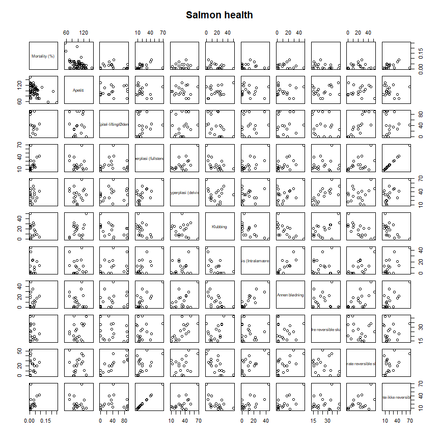<!-- -->

### Plankton 0-4 m        
* Diatoms have a strong influence on the total  
* But the highest total is on a day with much dinoflagellates and flagellates
```
 [1] "Sum totalt 0-4"                   "Diatoms 0-4"                      "Dinoflagellates 0-4"             
 [4] "Flagellates 0-4"                  "Chaetoceros 0-4"                  "Chaetoceros debilis 0-4"         
 [7] "Chaetoceros wighamii 0-4"         "Dictyocha speculum flagellat 0-4" "Karenia mikimotoi 0-4"           
[10] "Karlodinium veneficum 0-4"        "Prymnesiales <5 um 0-4"           "Prymnesiales 5-10 um 0-4"        
[13] "Prymnesiales 10-15 um 0-4"        "Prymnesiales total 0-4"          
```


```r
plot(dat[1:14 + 21], main = "Plankton 0-4 m")
```

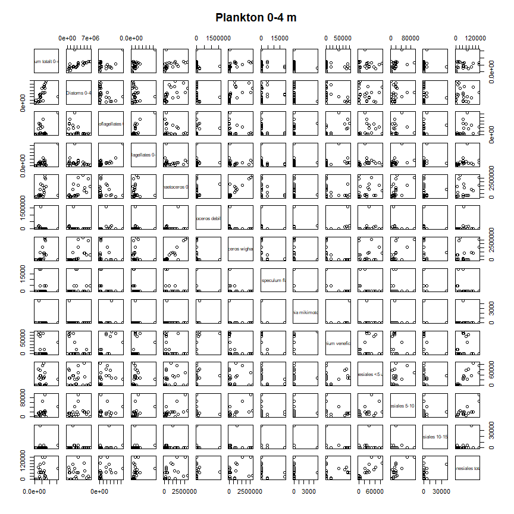<!-- -->

### Plankton 0-4 m        
* Diatoms have a strong influence on the total  
* But the highest total is on a day with much dinoflagellates and flagellates
```
 [1] "Sum totalt 6"                   "Diatoms 6"                      "Dinoflagellates 6"             
 [4] "Flagellates 6"                  "Chaetoceros 6"                  "Chaetoceros decipiens 6"       
 [7] "Chaetoceros wighamii 6"         "Dictyocha speculum flagellat 6" "Karenia mikimotoi 6"           
[10] "Karlodinium veneficum 6"        "Prymnesiales <5 um 6"           "Prymnesiales 5-10 um 6"        
[13] "Prymnesiales 10-15 um 6"        "Prymnesiales total 6"             
```


```r
plot(dat[1:14 + 35], main = "Plankton 0-4 m")
```

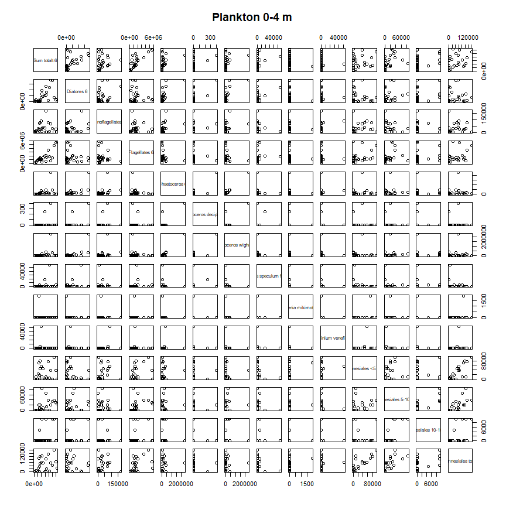<!-- -->

### Time series  

```r
gg1 <- dat %>%
  select(Week, `Chaetoceros wighamii 0-4`, `Chaetoceros wighamii 6`) %>%
  tidyr::pivot_longer(cols = -Week, names_to = "Variable", values_to = "Value") %>%
  ggplot(aes(Week, Value, color = Variable)) +
  geom_point() +
  geom_smooth(method = 'loess', formula = 'y ~ x') + 
  theme(
    legend.title = element_blank(),
    legend.position = c(.95, .95),
    legend.justification = c("right", "top"),
    legend.box.just = "right",
    legend.margin = margin(2,2,2,2),
    legend.text = element_text(size = rel(0.7)),
    legend.background = element_blank()
  )

gg2 <- dat %>%
  ggplot(aes(Week, `Signifikante ikke reversible skader`)) +
  geom_point() +
  geom_smooth(method = 'loess', formula = 'y ~ x', span = 0.4)
# gg2  

gg3 <- dat %>%
  ggplot(aes(Week, `Mortality (%)`)) +
  geom_point() +
  geom_smooth(method = 'loess', formula = 'y ~ x', span = 0.2)
# gg2  

cowplot::plot_grid(gg1, gg2, gg3, ncol = 1)
```

```
## Warning: Removed 66 rows containing non-finite values (stat_smooth).
```

```
## Warning: Removed 66 rows containing missing values (geom_point).
```

```
## Warning: Removed 39 rows containing non-finite values (stat_smooth).
```

```
## Warning: Removed 39 rows containing missing values (geom_point).
```

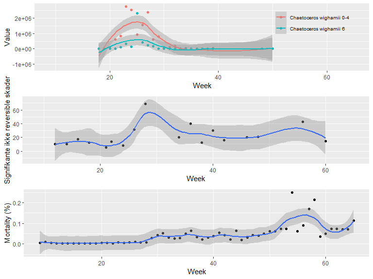<!-- -->

## 3. Initial analysis of mortality     

Inspired by https://datascienceplus.com/arima-models-and-intervention-analysis/  

### Define mortality as time series   
Not including the part after week 52 

```r
dat2 <- dat %>% 
  dplyr::filter(Week <= 52)

mort_ts <- ts(dat2$`Mortality (%)`, frequency = 1, start = dat2$Week[1])
plot(mort_ts)
```

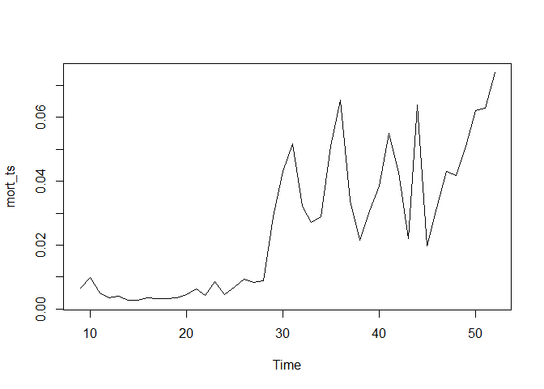<!-- -->


### Autocorrelation   
* Large autocorrelation with lag = 1, otherwise not

```r
par(mfrow=c(1,2), mar = c(4,2,2,1))
acf(mort_ts)
pacf(mort_ts)
```

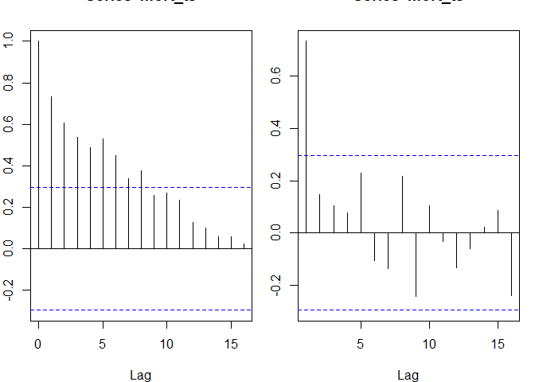<!-- -->

### Breakpoint analysis   
We assume maximum 1 breakpoint  

```r
break_point <- breakpoints(mort_ts ~ 1, breaks = 1)

# summary(break_point)

cat("Breakpoint found at week" , time(mort_ts)[break_point$breakpoints], "\n")
```

```
## Breakpoint found at week 28
```


#### Plot 1 breakpoint   

```r
plot(mort_ts)
lines(fitted(break_point, breaks = 1), col = 4)
```

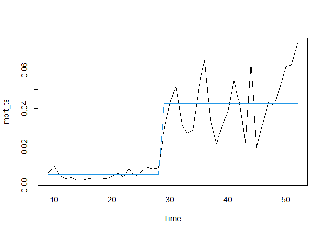<!-- -->

```r
# lines(confint(break_point, breaks = 1))
```

#### Plot alternative model with 2 breakpoints   

```r
plot(mort_ts)
lines(fitted(break_point, breaks = 2), col = 4)
```

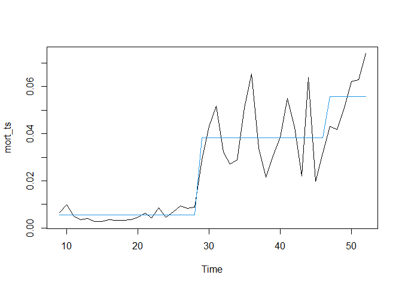<!-- -->

```r
# lines(confint(break_point, breaks = 1))
```


## 4. Time series analysis of mortality, no variables    
* Full time series (until week 52)  


```r
# Still following https://datascienceplus.com/arima-models-and-intervention-analysis/
```


### Model 1. Auto ARIMA (non-seasonal)   

* results in (0,1,1), as determined by auto.arima() within forecast package    
* 0,1,1: AIC = -247.4881  
* 1,1,1: AIC = -245.9941  

```r
(model_1 <- auto.arima(mort_ts, stepwise = FALSE, trace = FALSE))
```

```
## Series: mort_ts 
## ARIMA(0,1,1) with drift 
## 
## Coefficients:
##           ma1   drift
##       -0.6119  0.0014
## s.e.   0.1682  0.0008
## 
## sigma^2 estimated as 0.0001641:  log likelihood=127.15
## AIC=-248.3   AICc=-247.68   BIC=-243.01
```

### Model 2. Auto ARIMA including a level shift   
* Actually a 0,0,0 model comes out as best  

```r
level <- c(rep(0, break_point$breakpoints), 
           rep(1, length(mort_ts) - break_point$breakpoints))

(model_2 <- auto.arima(mort_ts, xreg = level, stepwise = FALSE, trace = FALSE))
```

```
## Series: mort_ts 
## Regression with ARIMA(0,0,0) errors 
## 
## Coefficients:
##       intercept    xreg
##          0.0055  0.0372
## s.e.     0.0025  0.0034
## 
## sigma^2 estimated as 0.0001357:  log likelihood=134.49
## AIC=-262.99   AICc=-262.39   BIC=-257.64
```

### Compare AICc of models  
* Huge difference  

```r
cat("AICc model 1 (no change):", model_1$aicc, "\n")
cat("\n")

cat("AICc model 2 (step change up):", model_2$aicc, "\n")
cat("- Week of step change, model 2: week", 
    time(mort_ts)[break_point$breakpoints], "\n")
cat("\n")
```

```
## AICc model 1 (no change): -247.6801 
## 
## AICc model 2 (step change up): -262.3898 
## - Week of step change, model 2: week 28
```


### Check residuals   
* No remaining autoregression  

```r
checkresiduals(model_2)
```

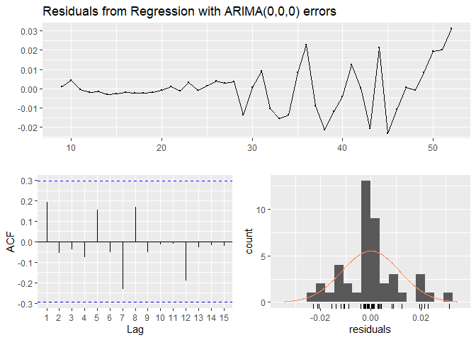<!-- -->

```
## 
## 	Ljung-Box test
## 
## data:  Residuals from Regression with ARIMA(0,0,0) errors
## Q* = 8.328, df = 7, p-value = 0.3046
## 
## Model df: 2.   Total lags used: 9
```

## 5. Time series analysis of mortality with variables    

* We start in week 18    
* That's when the plankton time series start   
* Redefine time series and breakpoints, and model 1 and 2  

### Re-defining time series and breakpoints   


```r
# Row numbers in dat2 (which already has the end chopped off)
start <- 10    # Start of `Chaetoceros wighamii 0-4` series
end <- 32      # Week 40, ie. 1 week after  end of continuous plankton series   
row_no <- start:end

cat("Week numbers analysed:")
dat2$Week[row_no] %>% range()

# Redefine mortality as time series   
mort_ts <- ts(dat2$`Mortality (%)`[row_no], frequency = 1, start = dat2$Week[row_no][1])
# autoplot(mort_ts)

# Breakpoints
break_point <- breakpoints(mort_ts ~ 1, breaks = 1)
plot(mort_ts)
lines(fitted(break_point, breaks = 1), col = 4)
```

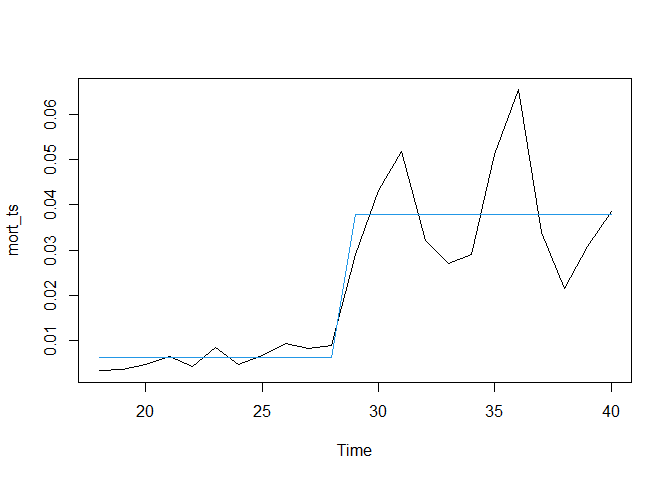<!-- -->

```
## Week numbers analysed:[1] 18 40
```
### Reestimate model 1 and 2  

```r
# Level variable  
level <- c(rep(0, break_point$breakpoints), 
           rep(1, length(mort_ts) - break_point$breakpoints))

# Models
model_1 <- auto.arima(mort_ts, stepwise = FALSE, trace = FALSE)
model_2 <- auto.arima(mort_ts, xreg = level, stepwise = FALSE, trace = FALSE)  

cat("AICc model 1:", model_1$aicc, "\n")
cat("AICc model 2:", model_2$aicc, "\n")

cat("Week of step change, model 2: week", 
    time(mort_ts)[break_point$breakpoints], 
    "\n")
```

```
## AICc model 1: -132.9748 
## AICc model 2: -153.3938 
## Week of step change, model 2: week 28
```

### Model 3. Effects of past Chaetoceros wighamii abundance 

* Using mean of 0-4 and 6 meter (`Chaetoceros wighamii 0-4`, `Chaetoceros wighamii 6`)  

```r
# Mean of 0-4 and 6 meter ( = 'Chaetoceros_wighamii')
dat2 <- dat2 %>%
  mutate(Chaetoceros_wighamii = (`Chaetoceros wighamii 0-4` + `Chaetoceros wighamii 6`)/2) 

# MAke a list of Chaetoceros_wighamii variables with different time lags (0 - 3)  

Cwig <- list(
  dat2$Chaetoceros_wighamii[row_no],
  dat2$Chaetoceros_wighamii[row_no - 1],
  dat2$Chaetoceros_wighamii[row_no - 2],
  dat2$Chaetoceros_wighamii[row_no - 3])
names(Cwig) <- paste("Model 3 lag", 0:3)

# Check
# Cwig


# Testinh
# model_3_test <- auto.arima(mort_ts, xreg = Cwig[["Lag 1"]], stepwise = FALSE, trace = FALSE)  
# model_3_test$aicc

# Run auto.arima for all lags   
model_3 <- Cwig %>% 
  purrr::map(
    ~auto.arima(mort_ts, xreg = .x, stepwise = FALSE, trace = FALSE)
  )

model_3_aicc <- purrr::map_dbl(model_3, "aicc")
model_3_aicc
```

```
## Model 3 lag 0 Model 3 lag 1 Model 3 lag 2 Model 3 lag 3 
##    -121.21291    -122.20252    -113.84916     -98.37078
```


### Model 4. Effects of significant non-reversible injury (Signifikante ikke reversible skader)   

#### Interpolate 'injury' variable  

```r
# We need to interpolate this time series  
plot(`Signifikante ikke reversible skader` ~ Week, dat2)

df <-  approx(
  dat2$Week, 
   dat2$`Signifikante ikke reversible skader`,
  xout = 9:52)

# df

# Set start to equal first data
i <- which(!is.na(df$y)) %>% head(1)
df$y[seq(1, i-1)] <- df$y[i]

# Set start to equal last data
i <- which(!is.na(df$y)) %>% tail(1)
df$y[seq(i+1, length(df$y))] <- df$y[i]

points(df$x, df$y, col = 2, pch = "*")
```

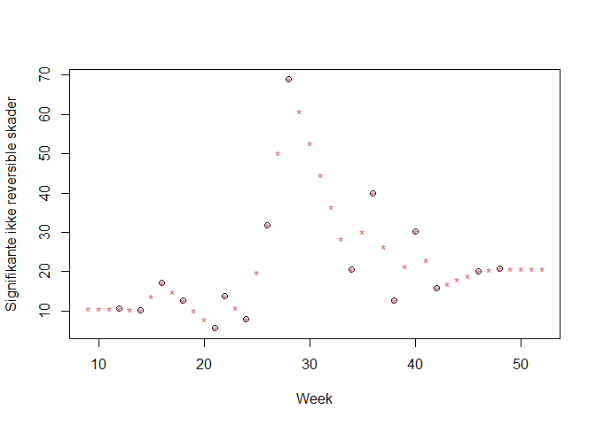<!-- -->

```r
# Use as interpolated data
injury_interpolated <- df
```

#### Estimate models  

```r
Injury <- list(
  injury_interpolated$y[row_no],
  injury_interpolated$y[row_no - 1],
  injury_interpolated$y[row_no - 2],
  injury_interpolated$y[row_no - 3])
names(Injury) <- paste("Model 4 lag", 0:3)


# Check
# Injury


# Testinh
# model_3_test <- auto.arima(mort_ts, xreg = Cwig[["Lag 1"]], stepwise = FALSE, trace = FALSE)  
# model_3_test$aicc

# Run auto.arima for all lags   
model_4 <- Injury %>% 
  purrr::map(
    ~auto.arima(mort_ts, xreg = .x, stepwise = FALSE, trace = FALSE)
  )

model_4_aicc <- purrr::map_dbl(model_4, "aicc")
model_4_aicc
```

```
## Model 4 lag 0 Model 4 lag 1 Model 4 lag 2 Model 4 lag 3 
##     -131.0252     -131.7140     -129.9574     -141.3285
```

### Summary    

#### AICc values (the lower, the 'better')   
* The best model is the "step change" model, model 2  
* This model does not have any explanatory value of course  
* The best model with explanatory value, and the only that is better than the null model (model 1), is model 4 (significant non-reversible injury) with a time lag of 3 weeks   
* The model 4 has an AICc that is a lot lower (8.35) than the null model (AICc difference of >= 2 is considered a significant difference)       

```r
cat("AICc model 1 (no change):", model_1$aicc, "\n")
cat("\n")

cat("AICc model 2 (step change up):", model_2$aicc, "\n")
cat("- Week of step change, model 2: week", 
    time(mort_ts)[break_point$breakpoints], "\n")
cat("\n")

cat("AICc model 3 (Chaetoceros wighamii abundance): \n")
model_3_aicc
cat("\n")

cat("AICc model 4 (significant non-reversible injury): \n")
model_4_aicc
cat("\n")

cat("Difference between model 4 (lag 3) and the null model:")
model_4_aicc[4] - model_1$aicc
```

```
## AICc model 1 (no change): -132.9748 
## 
## AICc model 2 (step change up): -153.3938 
## - Week of step change, model 2: week 28 
## 
## AICc model 3 (Chaetoceros wighamii abundance): 
## Model 3 lag 0 Model 3 lag 1 Model 3 lag 2 Model 3 lag 3 
##    -121.21291    -122.20252    -113.84916     -98.37078 
## 
## AICc model 4 (significant non-reversible injury): 
## Model 4 lag 0 Model 4 lag 1 Model 4 lag 2 Model 4 lag 3 
##     -131.0252     -131.7140     -129.9574     -141.3285 
## 
## Difference between model 4 (lag 3) and the null model:Model 4 lag 3 
##     -8.353756
```

#### Plot AICc values  

```r
# Collect all in one named vector
model_aicc <- c(model_1$aicc, model_2$aicc, model_3_aicc, model_4_aicc)
names(model_aicc)[1:2] <- paste("Model", 1:2)

# model_aicc

# Turn vector into data frame
df <- data.frame(Model = names(model_aicc),
                 AICc = model_aicc)

ggplot(df, aes(Model, AICc)) +
  geom_point() +
  theme(axis.text.x = element_text(angle = -45, hjust = 0),
        plot.margin = margin(6,18,6,6))
```

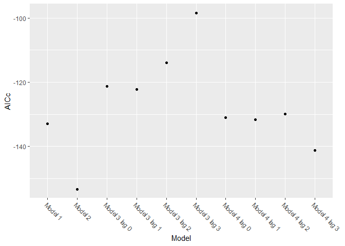<!-- -->


## 6. Effects of Chaetoceros wighamii (and Chaetoceros total) on different types of gill damage  

### Plot Chaetoceros wighamii + lung damage     
* Using mean of 0-4 and 6 meters   

```r
# names(dat2)[13:21] %>% dput()
vars <- c("Week", 
          "Epitel-lifting/Ødem", "Hyperplasi (fullstendig)", "Hyperplasi (delvis)", 
          "Klubbing", "Telangiectasis (Intralamære blødninger)", "Annen blødning", 
          "Mindre reversible skader", "Moderate reversible skader", "Signifikante ikke reversible skader",
          "Chaetoceros_wighamii")

dat2[vars] %>% 
  tidyr::pivot_longer(cols = -Week, 
                      names_to = "Variabel", values_to = "Value") %>%
  mutate(Variabel = factor(Variabel, levels = vars)) %>%
  ggplot(aes(Week, Value, color = Variabel)) + 
  geom_point()+ geom_smooth() +
  facet_wrap(vars(Variabel), scales = "free")
```

```
## `geom_smooth()` using method = 'loess' and formula 'y ~ x'
```

```
## Warning: Removed 272 rows containing non-finite values (stat_smooth).
```

```
## Warning: Removed 272 rows containing missing values (geom_point).
```

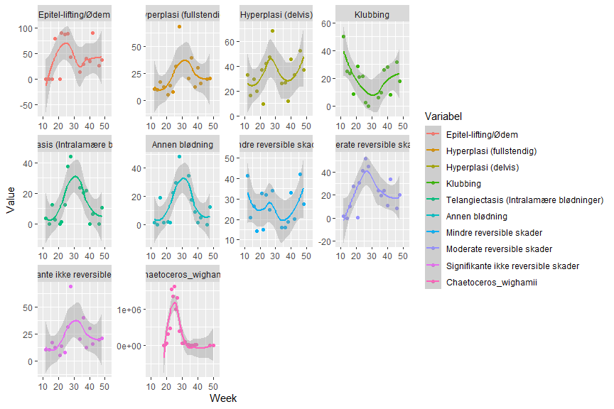<!-- -->
### Check data   
* Lots of holes in both variables  

```r
dat2 %>%
  select(Week, Chaetoceros_wighamii, `Annen blødning`) %>% head(20)
```

```
## # A tibble: 20 x 3
##     Week Chaetoceros_wighamii `Annen blødning`
##    <dbl>                <dbl>            <dbl>
##  1     9                   NA            NA   
##  2    10                   NA            NA   
##  3    11                   NA            NA   
##  4    12                   NA             1.67
##  5    13                   NA            NA   
##  6    14                   NA             0   
##  7    15                   NA            NA   
##  8    16                   NA            18.9 
##  9    17                   NA            NA   
## 10    18                 1360             1.59
## 11    19                 8745            NA   
## 12    20                50025            NA   
## 13    21               310700             2.22
## 14    22               462300             1.5 
## 15    23              1541300            NA   
## 16    24              1336000            22.7 
## 17    25              1613100            NA   
## 18    26               988925            29.6 
## 19    27              1297925            NA   
## 20    28               392400            48.3
```
### C. wighamii

#### Smooth plankton data in time     
* We smooth the plankton data (but not the salmomn data) in order to use all avaliable salmon data   
* Plankton abundance before the first plankton observation is set equal to the first plankton abundance we have     

```r
# Will be used in the GAM regression
dat2$Chaetoceros_wighamii_log <- log(dat2$Chaetoceros_wighamii + 1)

library(mgcv)

mod_not_used <- gam(Chaetoceros_wighamii ~ s(Week), data = dat2)
mod <- gam(Chaetoceros_wighamii_log ~ s(Week), data = dat2)

if (FALSE){
  par(mfrow = c(1,2), mar = c(4,5,2,1))
  plot(mod_not_used, res = TRUE, cex = 4)  
  plot(mod, res = TRUE, cex = 4)  
}

# Make 'Chaetoceros_wighamii_est' - new variable for estimated plankton data
dat2$Chaetoceros_wighamii_est <- NA

# Get t1-t2 - the time coverage of plankton data
df <- dat2 %>%
  arrange(Week) %>%
  filter(!is.na(Chaetoceros_wighamii))
t1 <- head(df$Week, 1)
t2 <- tail(df$Week, 1)
i1 <- which(dat2$Week == t1)
i2 <- which(dat2$Week == t2)

# predict plankton abundance within time coverage of plankton data
pred <- predict.gam(mod, newdata = data.frame(Week = t1:t2))
dat2$Chaetoceros_wighamii_est[i1:i2] <- round(exp(pred) + 1, 0)

#
# EXTRAPOLATION
#
# Fill before coverage and after coverage
# before_coverage <- 1:(i1:1)
# dat2$Chaetoceros_wighamii_est[before_coverage] <- dat2$Chaetoceros_wighamii_est[i1]
# 
# after_coverage <- (i2+1):nrow(dat2)
# dat2$Chaetoceros_wighamii_est[after_coverage] <- dat2$Chaetoceros_wighamii_est[i2]

# Check data
dat2 %>%
  select(Week, Chaetoceros_wighamii, Chaetoceros_wighamii_est)

ggplot(dat2, aes(Week, Chaetoceros_wighamii)) +
  geom_line(aes(y = Chaetoceros_wighamii_est)) +
  geom_point()
```

```
## Warning: Removed 11 row(s) containing missing values (geom_path).
```

```
## Warning: Removed 20 rows containing missing values (geom_point).
```

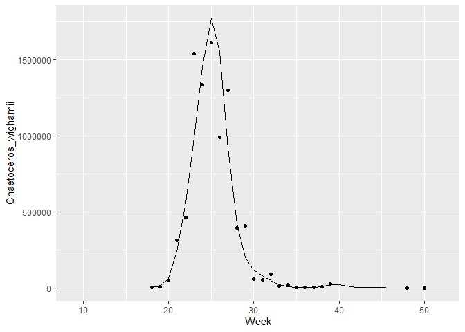<!-- -->

```
## # A tibble: 44 x 3
##     Week Chaetoceros_wighamii Chaetoceros_wighamii_est
##    <dbl>                <dbl>                    <dbl>
##  1     9                   NA                       NA
##  2    10                   NA                       NA
##  3    11                   NA                       NA
##  4    12                   NA                       NA
##  5    13                   NA                       NA
##  6    14                   NA                       NA
##  7    15                   NA                       NA
##  8    16                   NA                       NA
##  9    17                   NA                       NA
## 10    18                 1360                     1204
## # ... with 34 more rows
```

#### Make lag variables   
* Chaetoceros_wighamii_est = estimated C. wighamii the same week  
* Chaetoceros_wighamii_1week = estimated C. wighamii the week before    
* Chaetoceros_wighamii_2week = estimated C. wighamii two weeks before    

```r
dat2 <- dat2 %>%
  mutate(
    Chaetoceros_wighamii_1week = lag(Chaetoceros_wighamii_est, 1),
    Chaetoceros_wighamii_2week = lag(Chaetoceros_wighamii_est, 2)
  )
```

#### Functions for regression  

```r
model_varname <- function(y_variable, 
                          x_variable = c("Chaetoceros_wighamii_est",
                                         "Chaetoceros_wighamii_1week",
                                         "Chaetoceros_wighamii_2week"),
                          data){

  data$Y <- data[[y_variable]]  
  data$X0 <- data[[x_variable[1]]]  
  data$X1 <- data[[x_variable[2]]]  
  data$X2 <- data[[x_variable[3]]]  
  
  mod0 <- gam(Y ~ s(X0, k = 3), data = data)
  mod1 <- gam(Y ~ s(X1, k = 3), data = data)
  mod2 <- gam(Y ~ s(X2, k = 3), data = data)
  # summary(mod0)
  # summary(mod1)
  # summary(mod2)
  list(mod0 = mod0, mod1 = mod1, mod2 = mod2)
}

if (FALSE){
  L <- model_varname("Annen blødning", data = dat2)
  summary(L[[1]])
}


round_p <- function(p){
  if (p >= 0.05){
    result <- paste("P =", round(p, 2))
  } else if (p >= 0.01){
    result <- paste("P =", round(p, 3))
  } else if (p >= 0.001){
    result <- paste("P =", round(p, 4))
  } else {
    result <- "P < 0.001"
  }
  result
}
# round_p(0.06)
# round_p(0.02)
# round_p(0.00001)

plotmodel_varname <- function(y_variable, 
                              x_variable = c("Chaetoceros_wighamii_est",
                                             "Chaetoceros_wighamii_1week",
                                             "Chaetoceros_wighamii_2week"),
                              data,
                              x_variable_text = "C. wighamii"){
  
  data$Y <- data[[y_variable]]
  data$X0 <- data[[x_variable[1]]]  
  data$X1 <- data[[x_variable[2]]]  
  data$X2 <- data[[x_variable[3]]]  

  # Estimate models
  M <- model_varname(y_variable, x_variable, data)
  
  # Get p-values
  p0 <- summary(M$mod0)$s.table[,4] %>% round_p()
  p1 <- summary(M$mod1)$s.table[,4] %>% round_p()
  p2 <- summary(M$mod2)$s.table[,4] %>% round_p()
  
  par(mfrow = c(1,3), mar = c(4,5,1,1), oma = c(0,0,2.5,0))
  visreg(M$mod0, points = list(cex = 1))
  mtext(paste(x_variable_text,  "samme uke,", p0), cex = 0.75, line = 0.5)
  visreg(M$mod1, points = list(cex = 1))
  mtext(paste(x_variable_text,  "1 uke før,", p1), cex = 0.75, line = 0.5)
  visreg(M$mod2, points = list(cex = 1))
  mtext(paste(x_variable_text, "2 uker før,", p2), cex = 0.75, line = 0.5)
  mtext(paste("Effekt på", dQuote(y_variable)), outer = TRUE, line = 1)
}

if (FALSE)
  plotmodel_varname("Annen blødning", data = dat2)
```


### C. wighamii plots  

#### All regressions  

```r
# names(dat2)[13:21] %>% dput()
vars <- c("Epitel-lifting/Ødem", "Hyperplasi (fullstendig)", "Hyperplasi (delvis)", 
          "Klubbing", "Telangiectasis (Intralamære blødninger)", "Annen blødning", 
          "Mindre reversible skader", "Moderate reversible skader", "Signifikante ikke reversible skader")

for (var in vars){
  plotmodel_varname(var, data = dat2)
}
```

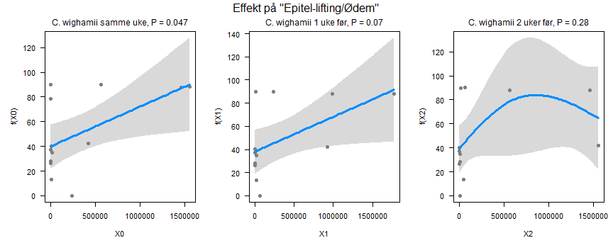<!-- -->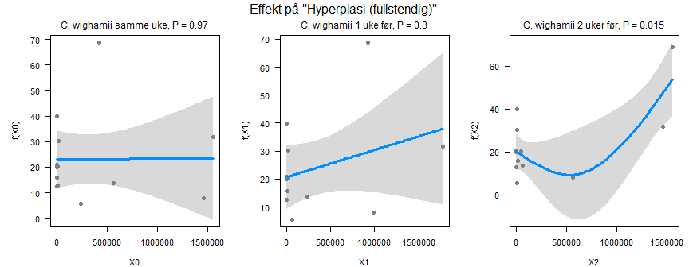<!-- -->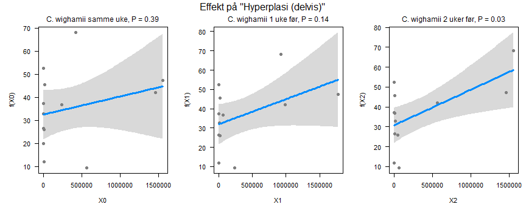<!-- -->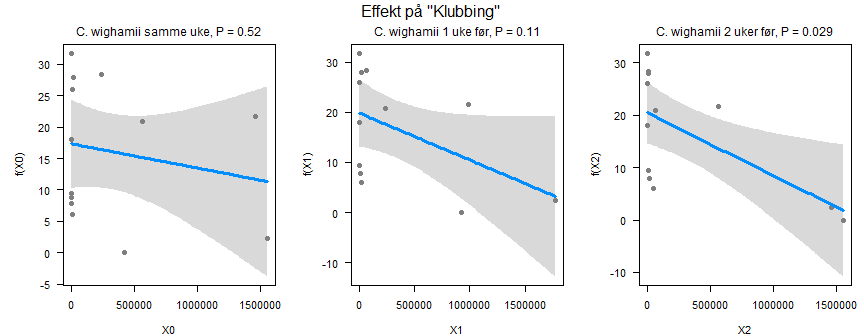<!-- -->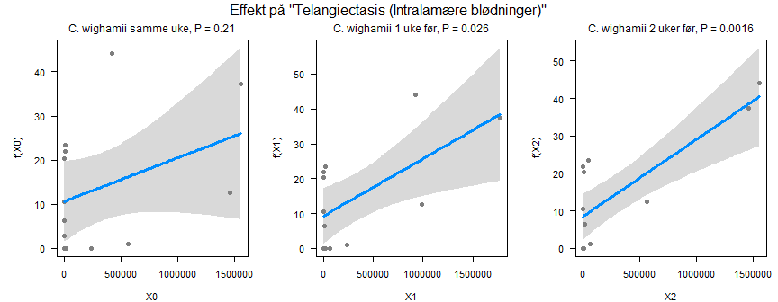<!-- -->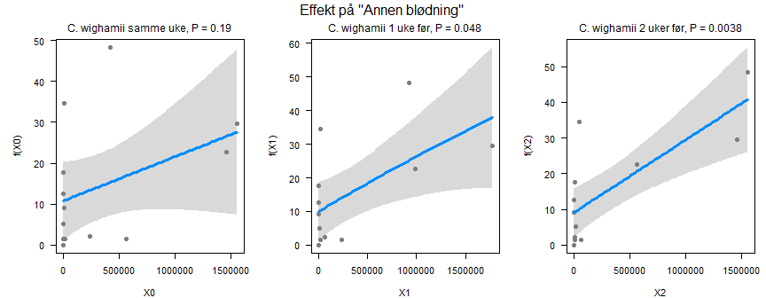<!-- -->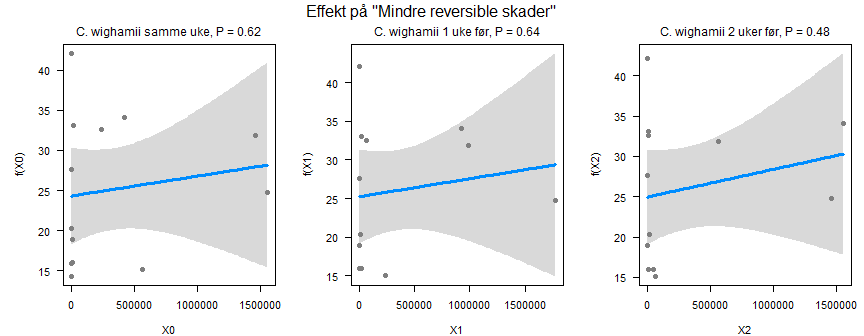<!-- -->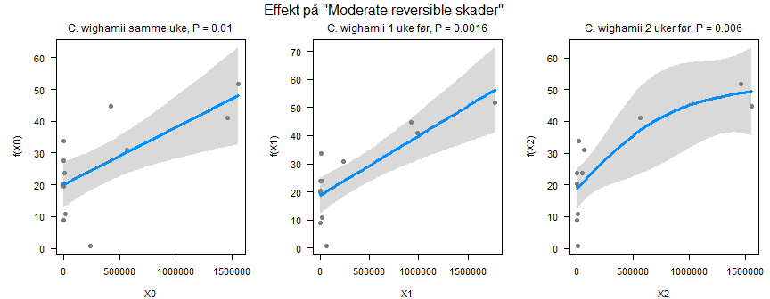<!-- -->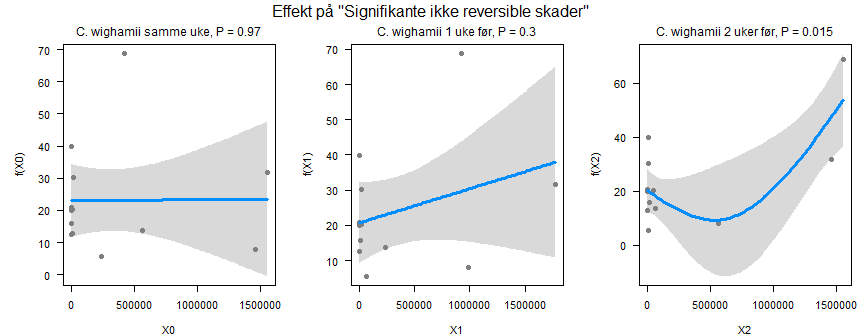<!-- -->

### Chaetoceros spp. total  

#### Check data   
* Lots of holes in both variables  

```r
dat2 %>%
  select(Week, 
         `Chaetoceros 0-4`, `Chaetoceros debilis 0-4`, `Chaetoceros wighamii 0-4`, 
         `Chaetoceros 6`, `Chaetoceros decipiens 6`, `Chaetoceros wighamii 6`, 
         Chaetoceros_wighamii) # %>% head(20)

dat2 %>%
  select(Week, 
         `Chaetoceros 0-4`, `Chaetoceros debilis 0-4`, `Chaetoceros wighamii 0-4`, 
         `Chaetoceros 6`, `Chaetoceros decipiens 6`, `Chaetoceros wighamii 6`, 
         Chaetoceros_wighamii) %>% 
  tidyr::pivot_longer(cols = -Week, 
                      names_to = "Variabel", values_to = "Value") %>%
  ggplot(aes(Week, Value, color = Variabel)) + 
  geom_point()+ geom_smooth() +
  facet_wrap(vars(Variabel))  
```

```
## `geom_smooth()` using method = 'loess' and formula 'y ~ x'
```

```
## Warning: Removed 140 rows containing non-finite values (stat_smooth).
```

```
## Warning: Removed 140 rows containing missing values (geom_point).
```

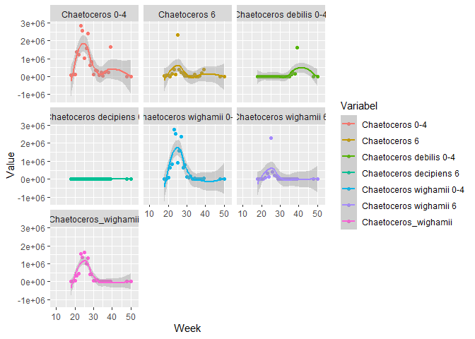<!-- -->

```
## # A tibble: 44 x 8
##     Week `Chaetoceros 0-4` `Chaetoceros debi~ `Chaetoceros wigh~ `Chaetoceros 6`
##    <dbl>             <dbl>              <dbl>              <dbl>           <dbl>
##  1     9                NA                 NA                 NA              NA
##  2    10                NA                 NA                 NA              NA
##  3    11                NA                 NA                 NA              NA
##  4    12                NA                 NA                 NA              NA
##  5    13                NA                 NA                 NA              NA
##  6    14                NA                 NA                 NA              NA
##  7    15                NA                 NA                 NA              NA
##  8    16                NA                 NA                 NA              NA
##  9    17                NA                 NA                 NA              NA
## 10    18             73570                640                480           57760
## # ... with 34 more rows, and 3 more variables: Chaetoceros decipiens 6 <dbl>,
## #   Chaetoceros wighamii 6 <dbl>, Chaetoceros_wighamii <dbl>
```


#### Make sum  

```r
# Mean of 0-4 and 6 meter ( = 'Chaetoceros_spp')
dat2 <- dat2 %>%
  mutate(Chaetoceros_spp = (`Chaetoceros 0-4` + `Chaetoceros 6`)/2) 
```


#### Smooth plankton data in time   
* We smooth the plankton data (but not the salmomn data) in order to use all avaliable salmon data   
* Plankton abundance before the first plankton observation is set equal to the first plankton abundance we have     
* NOTE: the smoothing doesn't catch the second peak very well  

```r
# Will be used in the GAM regression
dat2$Chaetoceros_spp_log <- log(dat2$Chaetoceros_spp + 1)

library(mgcv)

mod_not_used <- gam(Chaetoceros_spp ~ s(Week), data = dat2)
mod <- gam(Chaetoceros_spp_log ~ s(Week), data = dat2)

if (FALSE){
  par(mfrow = c(1,2), mar = c(4,5,2,1))
  plot(mod_not_used, res = TRUE, cex = 4)  
  plot(mod, res = TRUE, cex = 4)  
}

# Make 'Chaetoceros_spp_est' - new variable for estimated plankton data
dat2$Chaetoceros_spp_est <- NA

# Get t1-t2 - the time coverage of plankton data
df <- dat2 %>%
  arrange(Week) %>%
  filter(!is.na(Chaetoceros_spp))
t1 <- head(df$Week, 1)
t2 <- tail(df$Week, 1)
i1 <- which(dat2$Week == t1)
i2 <- which(dat2$Week == t2)

# predict plankton abundance within time coverage of plankton data
pred <- predict.gam(mod, newdata = data.frame(Week = t1:t2))
dat2$Chaetoceros_spp_est[i1:i2] <- round(exp(pred) + 1, 0)

#
# EXTRAPOLATION
#
# Fill before coveraage and after coverage
# before_coverage <- 1:(i1:1)
# dat2$Chaetoceros_spp_est[before_coverage] <- dat2$Chaetoceros_spp_est[i1]
# after_coverage <- (i2+1):nrow(dat2)
# dat2$Chaetoceros_spp_est[after_coverage] <- dat2$Chaetoceros_spp_est[i2]

# Check data
dat2 %>%
  select(Week, Chaetoceros_spp, Chaetoceros_spp_est)

ggplot(dat2, aes(Week, Chaetoceros_spp)) +
  geom_line(aes(y = Chaetoceros_spp_est)) +
  geom_point()
```

```
## Warning: Removed 11 row(s) containing missing values (geom_path).
```

```
## Warning: Removed 20 rows containing missing values (geom_point).
```

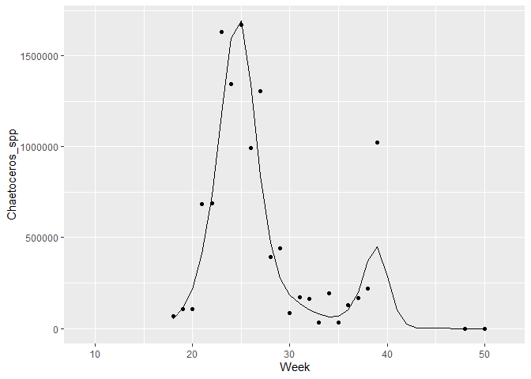<!-- -->

```
## # A tibble: 44 x 3
##     Week Chaetoceros_spp Chaetoceros_spp_est
##    <dbl>           <dbl>               <dbl>
##  1     9              NA                  NA
##  2    10              NA                  NA
##  3    11              NA                  NA
##  4    12              NA                  NA
##  5    13              NA                  NA
##  6    14              NA                  NA
##  7    15              NA                  NA
##  8    16              NA                  NA
##  9    17              NA                  NA
## 10    18           65665               54313
## # ... with 34 more rows
```

#### Make lag variables   
* Chaetoceros_spp_est = estimated Chaetoceros spp. the same week  
* Chaetoceros_spp_1week = estimated Chaetoceros spp. the week before    
* Chaetoceros_spp_2week = estimated Chaetoceros spp. two weeks before    

```r
dat2 <- dat2 %>%
  mutate(
    Chaetoceros_spp_1week = lag(Chaetoceros_spp_est, 1),
    Chaetoceros_spp_2week = lag(Chaetoceros_spp_est, 2)
  )
```


### Chaetoceros spp. total plots  

#### All regressions  

```r
# names(dat2)[13:21] %>% dput()
vars <- c("Epitel-lifting/Ødem", "Hyperplasi (fullstendig)", "Hyperplasi (delvis)", 
          "Klubbing", "Telangiectasis (Intralamære blødninger)", "Annen blødning", 
          "Mindre reversible skader", "Moderate reversible skader", "Signifikante ikke reversible skader")

for (var in vars){
  plotmodel_varname(var, 
                    x_variable = c("Chaetoceros_spp_est", "Chaetoceros_spp_1week", "Chaetoceros_spp_2week"),
                    data = dat2, x_variable_text = "Chaetoceros (total)"
                    )
}
```

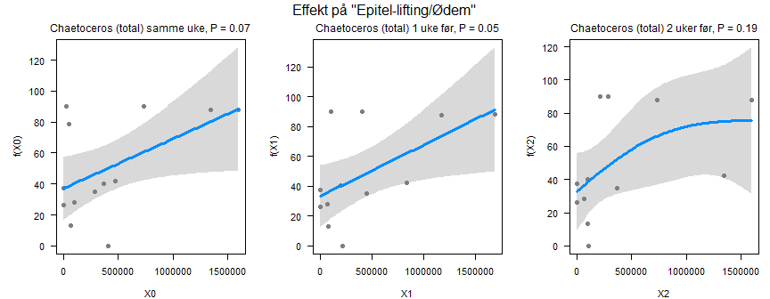<!-- -->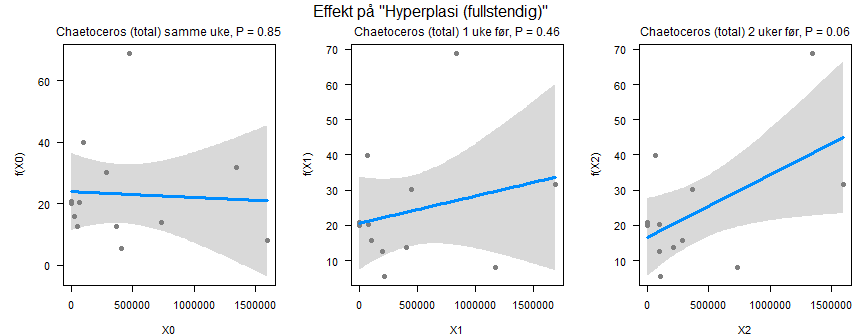<!-- -->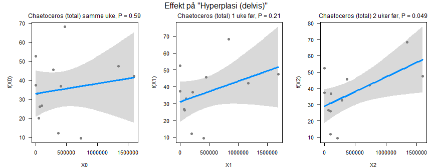<!-- -->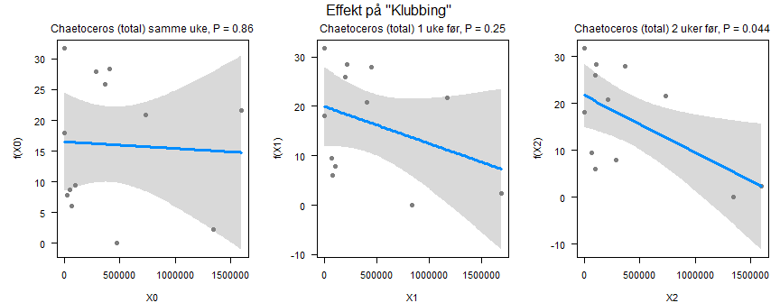<!-- -->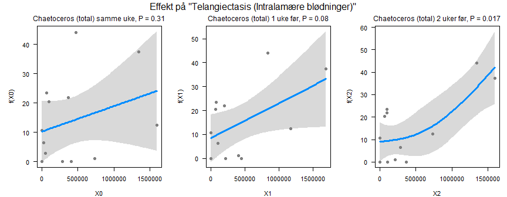<!-- -->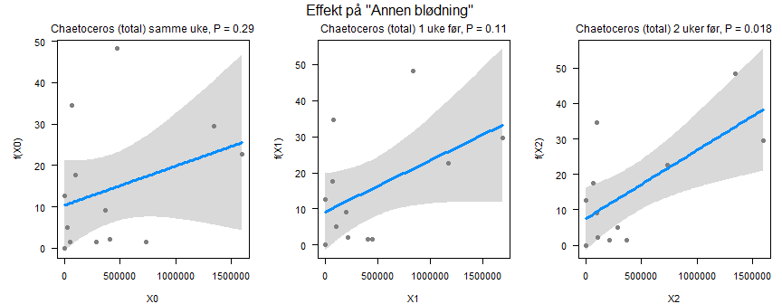<!-- -->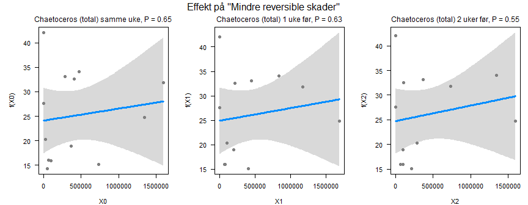<!-- -->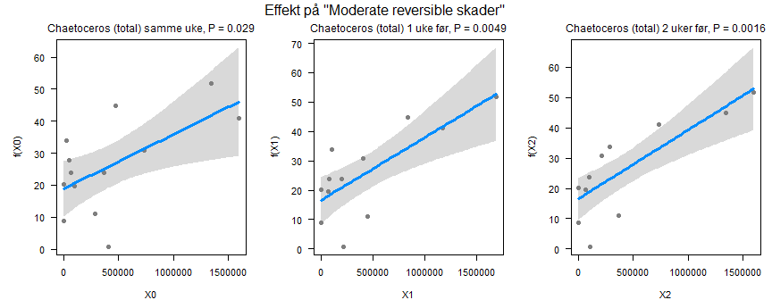<!-- -->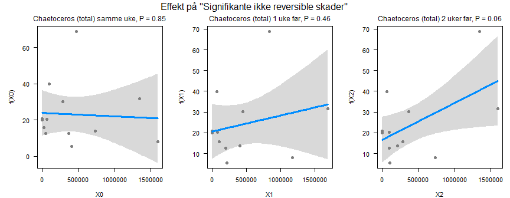<!-- -->


